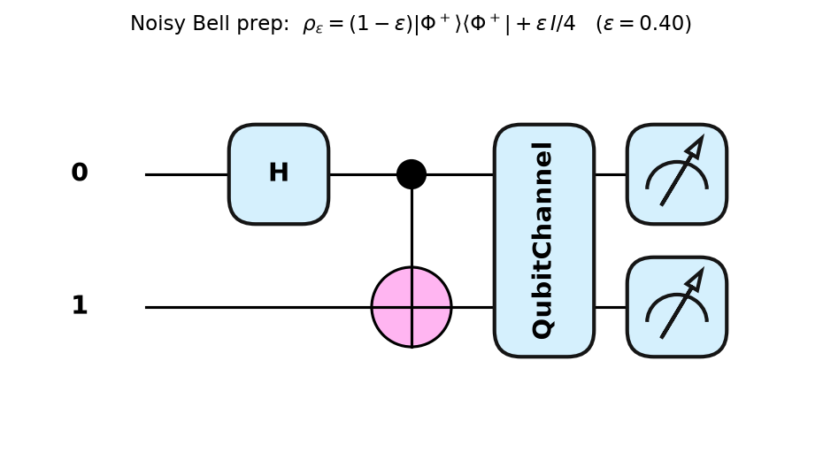
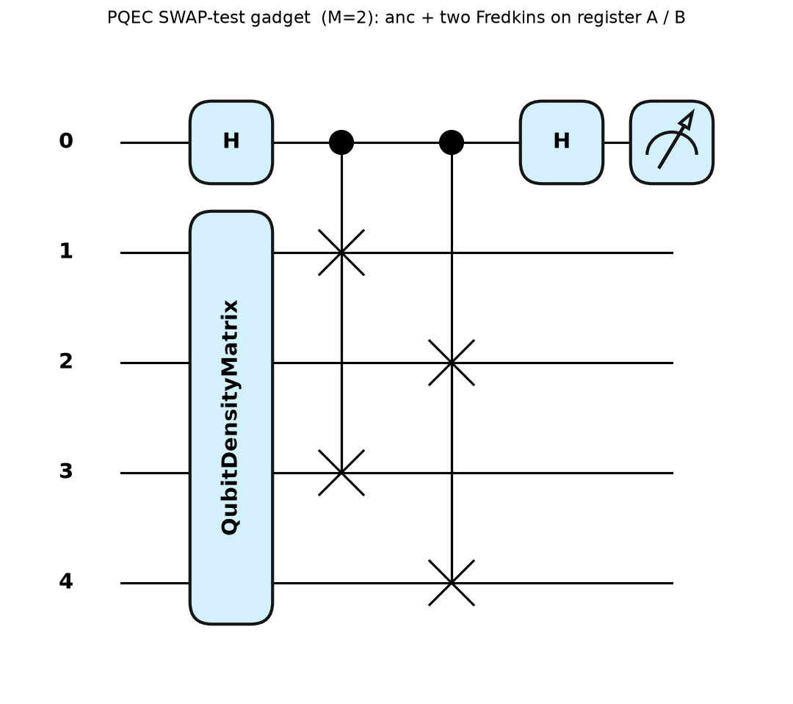
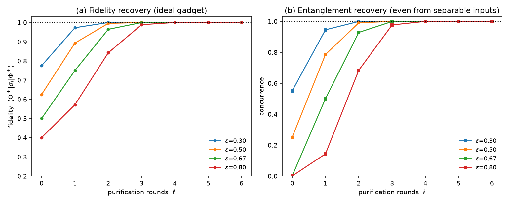
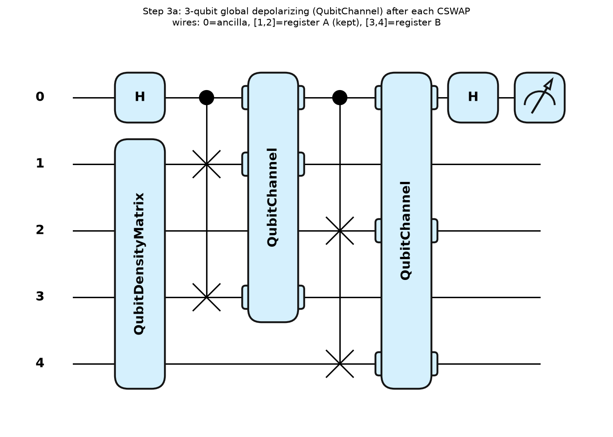
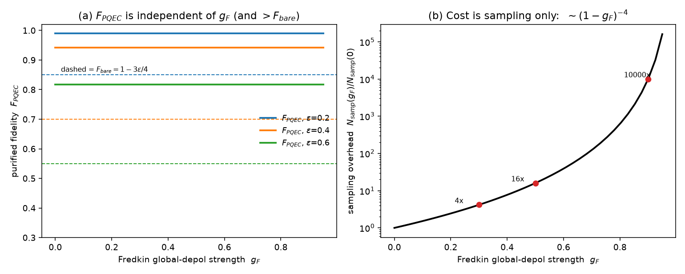
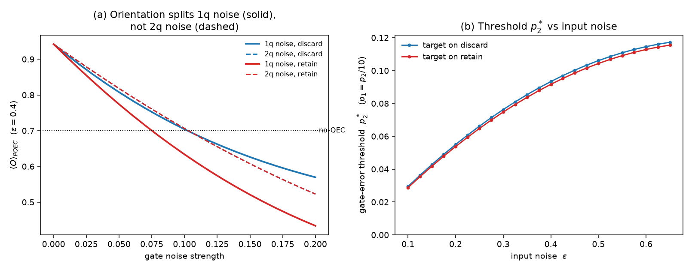
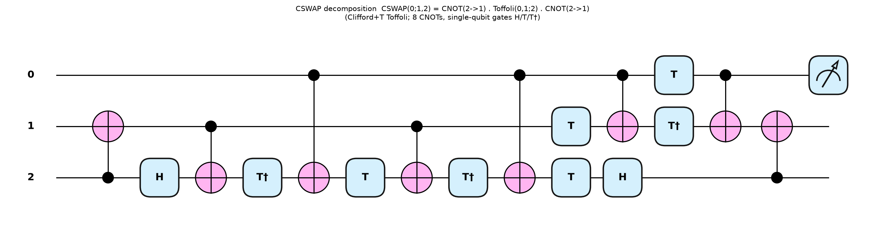
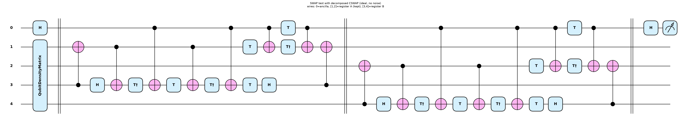
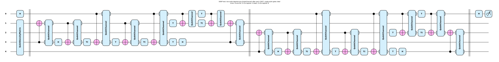

# PQEC Operational Threshold

Studying the **operational error threshold** of Purification Quantum Error
Correction (PQEC) for **entanglement distillation**.

The paper this builds on

> J. Raghoonanan & T. Byrnes, *Quantum Error Correction by Purification*,
> arXiv:2603.11568 (2026)

analyzes PQEC by applying a noise channel to the **data** and then a **perfect**
purification step. Real PQEC hardware — above all the 3-qubit controlled-SWAP
(Fredkin) at the heart of the SWAP test — is itself noisy. The goal of this
project is to go beyond the ideal-gadget analysis and find the threshold on the
**noise of the PQEC operations themselves** below which purification still
**recovers entanglement**.

This repository is being built up step by step. It starts from the noisy input
state and the tooling to certify it, before adding the (noisy) purification gadget.

## Status

| Step | Item | State |
|------|------|-------|
| 1 | Noisy input state `ρ_ε` — genuine preparation circuit + verification | **done** |
| 2 | Purification (SWAP-test) gadget — ideal, verified on `ρ_ε` | **done** |
| 3a | Fredkin **global** depolarizing — analytic benchmark (no threshold) | **done** |
| 3b | **Decomposed** Fredkin (native gates) + realistic noise — operational threshold | **done** |

## The noisy input state

The noisy input is the isotropic (global-depolarizing) Bell state

```
ρ_ε = (1 − ε) |Φ⁺⟩⟨Φ⁺| + ε · I/4,      |Φ⁺⟩ = (|00⟩ + |11⟩)/√2.
```

It is prepared by a genuine mixed-state circuit — `H · CNOT` to build `|Φ⁺⟩`,
then a **global 2-qubit depolarizing channel** of strength `ε` (a single
`QubitChannel` with the 16 two-qubit-Pauli Kraus operators):



Key closed forms (all checked by the verification code):

- fidelity `F = ⟨Φ⁺|ρ_ε|Φ⁺⟩ = 1 − 3ε/4`
- Bell-basis spectrum: `|Φ⁺⟩ → 1 − 3ε/4`, the three other Bell states → `ε/4` each
- purity `Tr(ρ_ε²) = (1 − 3ε/4)² + 3(ε/4)²`
- `ρ_ε` is entangled iff `F > 1/2`, i.e. `ε < 2/3`

## The purification gadget (Step 2)

The PQEC primitive is the **SWAP-test gadget**: two identical noisy copies
`ρ ⊗ ρ` enter, an ancilla-controlled SWAP (for the 2-qubit register, two parallel
Fredkin gates) is applied, and reading the ancilla extracts the purified component

```
P(ρ) = ρ² / Tr[ρ²]        (concentrates weight on the dominant eigenvector)
```



The gadget is implemented as a genuine 5-wire circuit with two equivalent
read-outs (both used when the gadget is made noisy in Step 3):

- **state extraction** (Eq. 9): `ρ² = (ancilla |0⟩ block) − (|1⟩ block)`, so
  `purify_once(ρ)` returns `ρ²/Tr[ρ²]`;
- **observable / parity correlator** (the paper's actual protocol):
  `⟨O⟩_purified = ⟨Z⊗O⟩ / ⟨Z⊗I⟩ = Tr(Oρ²)/Tr(ρ²)`.

Both are verified to machine precision (`~1e-16`) on 500 random states and on `ρ_ε`.

On the isotropic input `ρ_ε`, `|Φ⁺⟩` is the strictly dominant eigenvector for
**every `ε < 1`** (eigenvalues `1−3ε/4` vs `ε/4`), so the ideal gadget restores
fidelity and entanglement to 1 for all `ε < 1` — it even **re-entangles a
separable input** (`2/3 ≤ ε < 1`); only `ρ = I/4` at `ε = 1` is a fixed point.



## Noise on the gadget (Step 3a): Fredkin global depolarizing

First noisy-gadget model — right after each Fredkin, a **3-qubit global
depolarizing channel** of strength `g_F` on the three qubits it touched (ancilla
included): `G(σ) = (1−g_F)σ + g_F (I₈/8)⊗Tr_S(σ)`.

**Result: this model self-mitigates — signal loss, no threshold.** Both parity
correlators scale by `(1−g_F)²`, which cancels in the ratio, so the purified
fidelity is *independent* of `g_F` for `0 ≤ g_F < 1`:

```
F_PQEC(p, g_F) = (1+3α²)² / (4(1+3α⁴)) = F_ideal-PQEC(p),   α = 1−4p/3  (α² = 1−ε).
```

The only cost is a sampling-overhead divergence `N_samp ∼ (1−g_F)^{-4}`. All the
analytic formulas (numerator/denominator, `F_PQEC`, `F_bare`, `ΔF`, sampling) are
verified against the circuit to `~1e-13`. A hand derivation
(ordering `(a,A1,A2,B1,B2)`, closed forms after every gate) is reproduced
step-by-step by the circuit to `~1e-16` in `verify_note_states.py`.





A real operational threshold needs noise that attenuates numerator and denominator
**asymmetrically** (e.g. per-native-gate noise on a decomposed Fredkin) — that is
Step 3b.

## Realistic gate noise on a decomposed Fredkin (Step 3b)

Decompose each Fredkin into native 1- and 2-qubit gates and put realistic
depolarizing noise on **each native gate**. Representative decompositions:

- **textbook** `CSWAP(q;a,b) = CNOT(b→a)·Toffoli(q,a;b)·CNOT(b→a)`, Toffoli = the
  Clifford+T circuit (Nielsen & Chuang): 6 CNOT + T/H, so **1 Fredkin = 8 CNOTs**;
- **optimum** 5 two-qubit gates (Smolin & DiVincenzo, PRA 53, 2855 (1996));
- **recent** connectivity-aware low-CNOT counts (arXiv:2305.18128).

Noise: 2-qubit depolarizing `p2` after each CNOT, 1-qubit `p1` after each
single-qubit gate (`p1 = p2/10`). Sanity: `p1=p2=0` reproduces the ideal gadget to
`6.7e-16` (the decomposition is exact).

**Result: a finite operational threshold `p2*` appears.** Native-gate noise hits
the data qubits asymmetrically, so it does **not** cancel in the ratio —
`⟨O⟩_PQEC` falls with `p2` and crosses the no-QEC baseline at `p2* ≈ 0.05–0.12`
(growing with input noise). That is **far above realistic hardware 2-qubit errors**
(`~10⁻³–10⁻²`), so one PQEC round comfortably tolerates realistic gate noise.

**Exact analytic result** (verified on the circuit to `~1e-14`), with `u=1−ε₁`,
`v=1−ε₂`, `D=1+(1+2u⁴)v⁴t²`, and `F_dec = ¼[1 + t(1+t)C/D]`:

```
B = (u⁹v¹⁰/4)D,   A = (u⁹v¹⁰/16)[D + t(1+t)C]
C_retain (u,v) = 2u⁴v⁶ + u⁶v⁵ + 3u⁶v⁶       (K₁ → 5/2 at t=1)
C_discard(u,v) =  u⁶v⁵ + (1+u²+2u⁶+u⁸)v⁶     (K₁ → 2   at t=1)
```

Input `t = 1−ε` (global Bell-depolarizing input `ρ_ε`) or `(1−4p/3)²` (local
depolarizing `p` per Bell qubit) — same isotropic family. Conventions: `ε₂ = p₂`,
`ε₁ = 4p₁/3`.

**Orientation matters.** The Toffoli target leg carries the H/T/T† gates, so it
absorbs most single-qubit noise. Putting that target on the **discarded** register
shields the kept register (`C_discard`, `K₁ = 2`); putting it on the **retained**
register does not (`C_retain`, `K₁ = 5/2`). The denominator `B`, the CNOT slope
`K₂ = 17/8`, and the `ε₂` threshold are **orientation-independent**. So a protocol
should orient each Fredkin with its Toffoli target on the register it discards.



### CNOT-only noise (single-qubit gates ideal)

For the operational-threshold study we focus on the case where **only the CNOTs
are noisy** (a two-qubit depolarizing `ε₂` after each CNOT) and the single-qubit
gates are ideal (`ε₁ = 0`, `u = 1`). Then the two orientation-dependent numerators
**coincide**,

```
C_retain(1,v) = C_discard(1,v) = v⁵ + 5v⁶ ,   v = 1−ε₂ ,
```

so the result is **orientation-independent** — the earlier orientation split was
entirely a single-qubit-noise effect. The purified fidelity is
`F_dec = ¼[1 + t(1+t)(v⁵+5v⁶)/(1+3v⁴t²)]`, and the CNOT-only threshold `ε₂*`
(general 8-CNOT decomposition) is:

| input `ε` | 0.10 | 0.20 | 0.30 | 0.40 | 0.50 | 0.60 |
|-----------|------|------|------|------|------|------|
| `ε₂*`     | 0.033 | 0.061 | 0.085 | 0.103 | 0.117 | 0.126 |

The three circuits ([`draw_cnot_noise.py`](draw_cnot_noise.py)):

**1. The CSWAP (Fredkin) decomposition** — `CSWAP(0;1,2) = CNOT(2→1)·Toffoli(0,1;2)·CNOT(2→1)` (Clifford+T Toffoli; 8 CNOTs):



**2. The full SWAP test using that decomposition** (ideal). Barriers separate
`state prep | CSWAP₁ | CSWAP₂ | final H` (wires: 0 = ancilla, [1,2] = kept
register A, [3,4] = discarded register B):



**3. The same SWAP test with a two-qubit depolarizing channel after each CNOT**
(single-qubit gates left ideal):



## Files

| File | Description |
|------|-------------|
| [`noisy_bell_state.py`](noisy_bell_state.py) | Prepares `ρ_ε` with a genuine circuit and `verify(eps)` — checks the analytic match, unit trace, Hermiticity, positive-semidefiniteness, the Bell spectrum, fidelity and purity |
| [`draw_noisy_bell.py`](draw_noisy_bell.py) | Draws the preparation circuit (`circuit_noisy_bell.png`) |
| [`pqec_gadget.py`](pqec_gadget.py) | Ideal SWAP-test gadget: `purify_once` / `purify_rounds` / `obs_purified`, verification, and the `ρ_ε` recovery demo |
| [`draw_pqec_gadget.py`](draw_pqec_gadget.py) | Draws the 5-wire gadget (`circuit_pqec_gadget.png`) |
| [`pqec_gadget_noise.py`](pqec_gadget_noise.py) | Fredkin **global** depolarizing `g_F`: noisy gadget, `obs_pqec_noisy`, effective state |
| [`draw_gadget_noise.py`](draw_gadget_noise.py) | Draws the Step 3a gadget (`circuit_gadget_noise.png`) |
| [`verify_analytic_global_depol.py`](verify_analytic_global_depol.py) | Verifies the analytic global-depol formulas against the circuit (`~1e-13`) |
| [`verify_note_states.py`](verify_note_states.py) | Reproduces the note's step-by-step states (`σ₀…σ_out`) on the circuit (`~1e-16`) |
| [`plot_global_depol_benchmark.py`](plot_global_depol_benchmark.py) | `F_PQEC` flatness + sampling divergence figure (`global_depol_benchmark.png`) |
| [`pqec_decomposed_noise.py`](pqec_decomposed_noise.py) | **Decomposed** Fredkin (CNOT+Toffoli) with per-native-gate depolarizing; finite threshold `p2*`, both orientations, scan + figure |
| [`verify_analytic_decomposed.py`](verify_analytic_decomposed.py) | Verifies the analytic `A/B/F_dec` (retain orientation) against the circuit (`~1e-14`); shows `B`/`K₂` orientation-independent, `K₁` not |
| [`draw_decomposed.py`](draw_decomposed.py) | Draws one decomposed Fredkin and the full decomposed gadget (`circuit_decomposed_*.png`) |
| [`draw_cnot_noise.py`](draw_cnot_noise.py) | Draws the CNOT-only diagrams: CSWAP decomposition, SWAP test, and SWAP test with 2-qubit depol after each CNOT (barrier-separated stages) |
| [`requirements.txt`](requirements.txt) | Dependencies (pinned minimums + tested versions) |

## Setup & run

```bash
python -m venv .venv
source .venv/bin/activate          # Windows: .venv\Scripts\activate
pip install -r requirements.txt

python noisy_bell_state.py         # build ρ_ε and verify it (sweep + 500 random ε)
python draw_noisy_bell.py          # regenerate the input circuit diagram
python pqec_gadget.py              # ideal gadget: verify + ρ_ε recovery demo
python draw_pqec_gadget.py         # regenerate the gadget circuit diagram
python pqec_gadget_noise.py        # Fredkin global depol: <O> vs g_F (self-mitigates)
python draw_gadget_noise.py        # Step 3a gadget circuit diagram
python verify_analytic_global_depol.py  # analytic formulas vs circuit (~1e-13)
python verify_note_states.py       # note's step-by-step states vs circuit (~1e-16)
python plot_global_depol_benchmark.py   # F_PQEC flatness + sampling divergence figure
python pqec_decomposed_noise.py    # decomposed Fredkin + gate noise: threshold p2* (both orientations)
python verify_analytic_decomposed.py  # analytic A/B/F_dec vs circuit; orientation effect
python draw_decomposed.py          # decomposed Fredkin + full gadget circuit diagrams
python draw_cnot_noise.py          # CNOT-only diagrams (CSWAP decomp, SWAP test, +CNOT noise)
```

### Verification output (excerpt)

```
eps = 0.200 | F = 0.8500 (=1-3eps/4=0.8500) | purity = 0.7300 | max|rho-target| = 1.67e-16 | PASS
eps = 0.500 | F = 0.6250 (=1-3eps/4=0.6250) | purity = 0.4375 | max|rho-target| = 5.55e-17 | PASS
...
500 random eps in [0,1]: max |rho - target| = 2.78e-16
ALL CHECKS PASSED
```

The circuit reproduces `ρ_ε` to machine precision (`~1e-16`) for arbitrary `ε ∈ [0,1]`.
