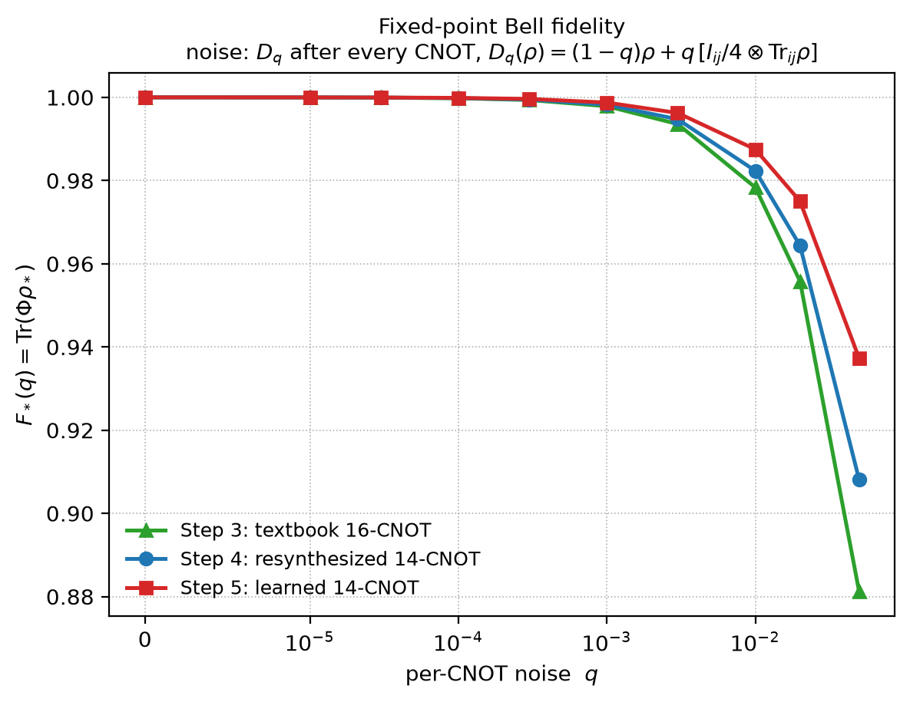
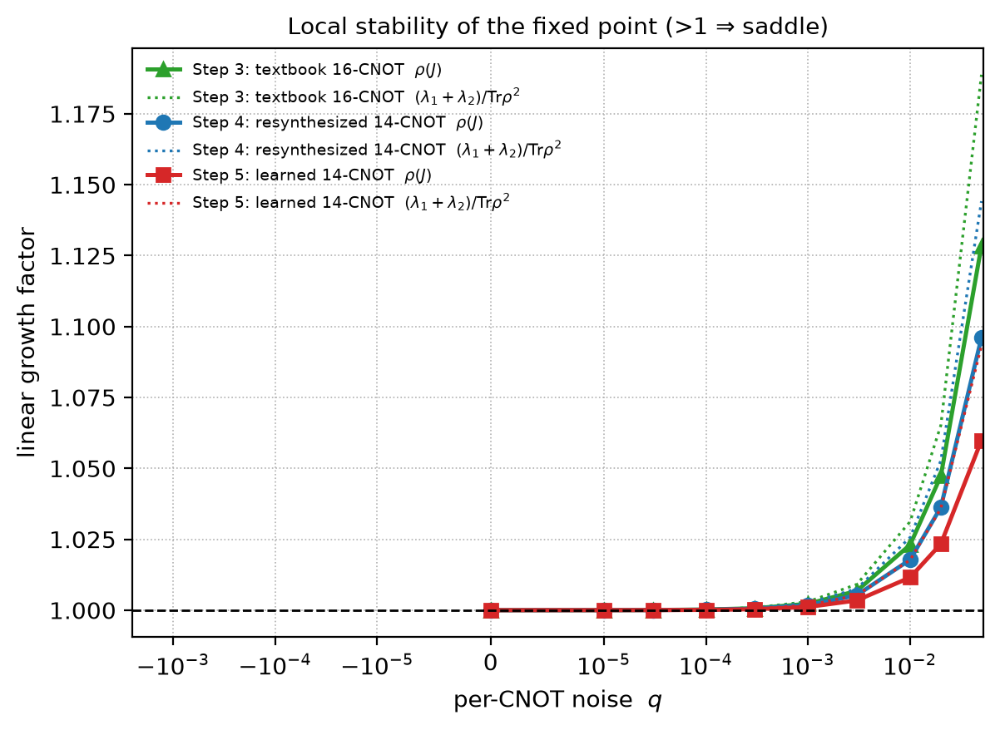
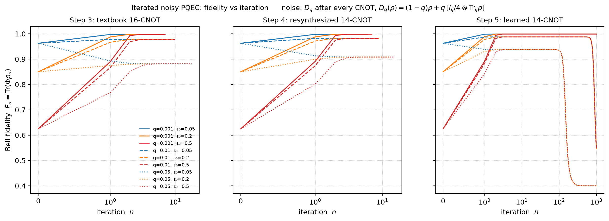

# Iterated noisy PQEC — fixed points of the effective nonlinear map

> Branch of **PQEC Operational Threshold**. What happens when the noisy round is **repeated**
> at fixed per-CNOT noise `q`?

## What this branch is about

The one-round study asks where `F_out > F_bare` (break-even). This branch asks a different
question: iterate the round and find the **limiting state**.

```
σ_in  = |0⟩⟨0|_a ⊗ ρ_A ⊗ ρ_B ,      ρ_A = ρ_B = ρ_n
τ_A   = Tr_{a,B}[ (Z_a ⊗ I) σ_out ]
ρ_{n+1} = P_q(ρ_n) = τ_A / Tr(τ_A)          ← NONLINEAR (normalisation)
```

Because each round consumes `ρ ⊗ ρ`, the map is **quadratic** in `ρ`; the normalisation makes
it nonlinear. Circuits are **not re-derived** — the gate sequences are captured from the
verified implementations of Steps 3, 4 and 5.

> ⚠️ `τ_A` is a parity-**weighted** operator, not the unconditional physical output of the
> round. Iterating it assumes the reconstructed effective state can be re-prepared as the two
> identical inputs of the next round: this is an *effective nonlinear map*, not a shot-by-shot
> experimental protocol.

## Validation (gate passed before any sweep)

| check | result |
|--|--|
| one-round `Q`, `N_Φ`, `F` vs the repository PennyLane executors | **≤ 1.5e-15** (all three circuits) |
| vs Step-3 / Step-4 closed forms | ≤ 1.4e-15 |
| replacement channel (definition) vs `global_depol_kraus` | 9.3e-17 |
| `τ_A = ρ²` at `q = 0` | 9.5e-16 (S3), 5.5e-16 (S4), **6.9e-9 (S5)** |

The Step-5 floor is intrinsic to its stored learned parameters (they realise `U` to
`δ_U ≈ 3e-15` in *fidelity* = `2e-7` in *amplitude*) — documented, not patched.

## Numerical results

**Limiting fidelity, purity and parity visibility** (`results/iterated_pqec/fixed_points.csv`):

| q | F\*(3) | F\*(4) | F\*(5) | P\*(3/4/5) | Q\*(3/4/5) |
|--|--|--|--|--|--|
| 0 | 1.000000 | 1.000000 | 1.000000 | 1 / 1 / 1 | 1 / 1 / 1 |
| 1e-3 | 0.997871 | 0.998249 | **0.998750** | .996/.997/.998 | .983/.985/.986 |
| 1e-2 | 0.978346 | 0.982351 | **0.987507** | .957/.965/.975 | .841/.860/.864 |
| 5e-2 | 0.881237 | 0.908138 | **0.937304** | .781/.828/.880 | .409/.462/.476 |



- **Ordering survives**: `F_*(5) > F_*(4) > F_*(3)` at every `q`, matching the one-round
  threshold ordering — again circuit *topology*, not CNOT count.
- **Small-q scaling**: `1 − F_*(q) = A·q^α` with **α = 1.0004 / 1.0002 / 1.0000** (strictly
  linear, no `q²` needed) and **A = 2.133 / 1.753 / 1.250**.
- **Initial-state independence**: all `ε₀ ∈ {0.05 … 0.5}` reach the same state (spread
  ≤ 3.3e-13), approached from **both** directions.

**The fixed point is a saddle — the main finding.** For `ρ → ρ²/Tr(ρ²)` an eigenbasis
coherence between eigenvalues `λ_i, λ_j` is amplified by `(λ_i+λ_j)/Tr(ρ²)`, which **exceeds 1
for every mixed state** (since `Tr(ρ²) ≤ λ₁ < λ₁+λ₂`). The numerical Jacobian confirms it
(`ρ(J)` = 1.128 / 1.096 / 1.060 at `q = 0.05`) and matches the measured growth rate.



Seeding that direction at `1e-9` makes **all three** circuits escape to a second, low-fidelity
attractor (`F ≈ 0.454 / 0.468 / 0.400`). Steps 3/4 never escape spontaneously because their
symmetry keeps the trajectory on the invariant Bell-diagonal manifold; **Step 5's learned
circuit breaks that symmetry and supplies its own seed**, so it departs after ~200–300 rounds:



Step 5 therefore has **no exact fixed point** (part of its residual lies along a marginal
`λ = 1` direction) — only a quasi-fixed plateau, which is nevertheless the best of the three.

**Physicality checks**: all iterates PSD (`min_eig ≥ −1e-16`), unit trace, `Q ≥ 0.236` (no
denominator collapse). A quadratic-map artifact was found and fixed: an anti-Hermitian
floating-point residue is amplified **exactly ×2 per round** (ρ⊗ρ has two slots), reaching
O(1) by `n ≈ 53`; each iterate is projected onto the Hermitian manifold with the discarded
norm recorded (stays ~1e-16).

## Core files

| file | role |
|--|--|
| `iterated_noisy_pqec.py` | the map, diagnostics, direct fixed-point solver, Jacobian, validation |
| `scripts/run_iterated_pqec.py` | full sweep (q × ε₀ × circuit) + 8 figures + serialisation |
| `tests/test_iterated_noisy_pqec.py` | 11 tests (validation, physicality, regression, saddle) |
| `results/iterated_pqec/` | `step{3,4,5}_results.csv`, `fixed_points.csv/.npz`, `metadata.json` |
| `figures/iterated_pqec/` | 8 analysis figures |

## Reproduce

```bash
git switch iterated-noisy-pqec
python iterated_noisy_pqec.py            # self-test + one-round validation
python tests/test_iterated_noisy_pqec.py # 11/11
python scripts/run_iterated_pqec.py      # full sweep (~1 min) + figures + results
```

## Relation to the other steps

Consumes the verified circuits of Steps 3, 4, 5 unchanged. **Do not confuse** the three
threshold notions: (1) the one-round break-even threshold `F_out > F_in` (Steps 3–5),
(2) the stable fixed point of the repeated map `ρ_* = P_q(ρ_*)` — *this branch*, and (3) the
original PQEC paper's asymptotic threshold with ideal purification layers.

## Branch map

| branch | contents |
|--|--|
| [`main`](../../tree/main) | integrated project: all steps, comparison code, full write-ups, paper figures |
| [`setup-bell-input`](../../tree/setup-bell-input) | Setup — Bell-isotropic input `ρ_t` preparation + verification |
| [`step-1-ideal-pqec`](../../tree/step-1-ideal-pqec) | Step 1 — ideal one-round PQEC baseline |
| [`step-2-fredkin-noise`](../../tree/step-2-fredkin-noise) | Step 2 — CSWAP-level global replacement depolarizing noise |
| [`step-3-textbook-16cnot`](../../tree/step-3-textbook-16cnot) | Step 3 — textbook 16-CNOT implementation, per-CNOT noise |
| [`step-4-resynthesized-14cnot`](../../tree/step-4-resynthesized-14cnot) | Step 4 — resynthesized 14-CNOT implementation, per-CNOT noise |
| [`step-5-learned-14cnot`](../../tree/step-5-learned-14cnot) | Step 5 — learned & pruned 14-CNOT implementation, per-CNOT noise |
| [`iterated-noisy-pqec`](../../tree/iterated-noisy-pqec) | repeated-round study: fixed points of the effective nonlinear map |
| [`archive-branched-substeps`](../../tree/archive-branched-substeps) | snapshot before the Step renumbering (old 3a/3b/4a/4b/5a/5b/5c labels) |

Every step branch is a **full copy** of the project (so it is independently checkout-able and
runnable); this README describes what *this* branch is for, and `STEP_GUIDE.md` lists its
inputs, noise model, scripts and outputs.

## Conventions used throughout

- input `ρ_t = ¼[II + t(XX − YY + ZZ)]`, `t = 1 − ε`; target `Φ = |Φ⁺⟩⟨Φ⁺|`; `F_bare = (1+3t)/4`
- wire ordering `(a, A₁, A₂, B₁, B₂) = (0,1,2,3,4)`: ancilla, retained register `A`, discarded `B`
- read-out `F = ⟨Z_a ⊗ O⟩ / ⟨Z_a⟩ = Tr(Oρ²)/Tr(ρ²)` (ancilla-parity correlator)
- **all single-qubit gates are ideal**; noise is applied only where the step's model says

## Setup

```bash
python -m venv .venv && source .venv/bin/activate
pip install -r requirements.txt
```

