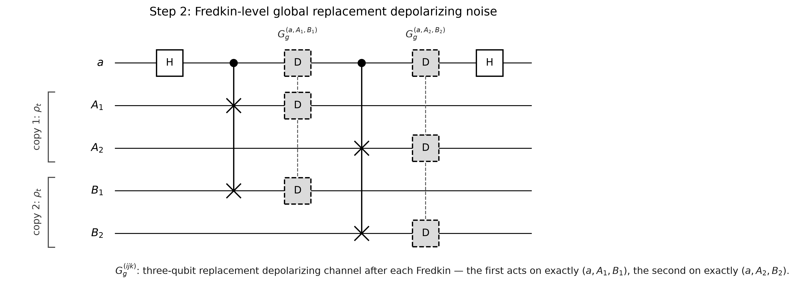

# Step 2 — CSWAP-level global replacement depolarizing noise

> Branch of **PQEC Operational Threshold**. The first noisy-gadget model — and the one that
> shows why a *symmetric* noise model gives **no** threshold.

## What this branch is about

Each controlled-SWAP is treated as a single primitive, and right after it a **three-qubit
replacement depolarizing channel** acts on exactly the three qubits it touched:

```
G_g^(ijk)(σ) = (1 − g)σ + g [ I_ijk/8 ⊗ Tr_ijk(σ) ]
```

The first channel acts on `(a, A₁, B₁)`, the second on `(a, A₂, B₂)`. Ancilla Hadamards and
read-out are ideal.



## Numerical results — this model self-mitigates (no threshold)

Both parity correlators scale by exactly `(1−g)²`, which **cancels in the ratio**, so the
purified fidelity is *independent of g* for `0 ≤ g < 1`:

```
F_PQEC(p, g) = (1 + 3α²)² / (4(1 + 3α⁴)) = F_ideal(p),   α = 1 − 4p/3  (α² = 1 − ε)
```

*Mechanism (Heisenberg picture)*: the measured observables `X_a⊗Φ_A`, `X_a⊗I_A` are traceless
on each noisy 3-qubit subsystem, so the channel's adjoint just multiplies each by `s = 1−g`;
the error branch fully randomises the ancilla and carries no parity signal.

Analytic vs circuit (`verify_analytic_global_depol.py`), all `~1e-13` or better:

| analytic | circuit error |
|--|--|
| `A = (1−g)²(1+3α²)²/16` (numerator) | 2e-15 |
| `B = (1−g)²(1+3α⁴)/4` (denominator) | 1e-15 |
| `F_PQEC = (1+3α²)²/(4(1+3α⁴))`, g-independent | **1e-13** |
| `F_bare = 1 − 3ε/4` | 7e-16 |
| `ΔF = 3α²(1−α²)(1+3α²)/(4(1+3α⁴)) > 0` | 6e-16 |
| sampling overhead `(B₀/B_g)² = (1−g)⁻⁴` | exact |

A step-by-step hand derivation (states `σ₀ … σ_out` after every gate) is reproduced by the
genuine circuit to **~1e-16** in `verify_note_states.py`.

**Consequence:** no finite `g` fidelity threshold; the only cost is a sampling-overhead
divergence `N_samp ∼ (1−g)⁻⁴`. A real operational threshold needs noise that attenuates
numerator and denominator **asymmetrically** — that is Step 3.

## Core files

| file | role |
|--|--|
| `pqec_gadget_noise.py` | noisy gadget, `obs_pqec_noisy`, effective state |
| `verify_analytic_global_depol.py` | analytic formulas vs circuit (~1e-13) |
| `verify_note_states.py` | hand-derivation states vs circuit (~1e-16) |
| `plot_global_depol_benchmark.py` | `global_depol_benchmark.png` |
| `draw_gadget_noise.py` | `circuit_gadget_noise.png` |

## Reproduce

```bash
git switch step-2-fredkin-noise
python pqec_gadget_noise.py             # ⟨O⟩ vs g (self-mitigates)
python verify_analytic_global_depol.py  # analytic vs circuit
python verify_note_states.py            # note states vs circuit
python plot_global_depol_benchmark.py   # benchmark figure
```

## Relation to the other steps

Analytic benchmark only: it isolates the *symmetric* failure mode. Steps 3–5 replace this
with per-CNOT noise on a decomposed gadget, which does produce a finite threshold.

## Branch map

| branch | contents |
|--|--|
| [`main`](../../tree/main) | integrated project: all steps, comparison code, full write-ups, paper figures |
| [`setup-bell-input`](../../tree/setup-bell-input) | Setup — Bell-isotropic input `ρ_t` preparation + verification |
| [`step-1-ideal-pqec`](../../tree/step-1-ideal-pqec) | Step 1 — ideal one-round PQEC baseline |
| [`step-2-fredkin-noise`](../../tree/step-2-fredkin-noise) | Step 2 — CSWAP-level global replacement depolarizing noise |
| [`step-3-textbook-16cnot`](../../tree/step-3-textbook-16cnot) | Step 3 — textbook 16-CNOT implementation, per-CNOT noise |
| [`step-4-resynthesized-14cnot`](../../tree/step-4-resynthesized-14cnot) | Step 4 — resynthesized 14-CNOT implementation, per-CNOT noise |
| [`step-5-learned-14cnot`](../../tree/step-5-learned-14cnot) | Step 5 — learned & pruned 14-CNOT implementation, per-CNOT noise |
| [`iterated-noisy-pqec`](../../tree/iterated-noisy-pqec) | repeated-round study: fixed points of the effective nonlinear map |
| [`archive-branched-substeps`](../../tree/archive-branched-substeps) | snapshot before the Step renumbering (old 3a/3b/4a/4b/5a/5b/5c labels) |

Every step branch is a **full copy** of the project (so it is independently checkout-able and
runnable); this README describes what *this* branch is for, and `STEP_GUIDE.md` lists its
inputs, noise model, scripts and outputs.

## Conventions used throughout

- input `ρ_t = ¼[II + t(XX − YY + ZZ)]`, `t = 1 − ε`; target `Φ = |Φ⁺⟩⟨Φ⁺|`; `F_bare = (1+3t)/4`
- wire ordering `(a, A₁, A₂, B₁, B₂) = (0,1,2,3,4)`: ancilla, retained register `A`, discarded `B`
- read-out `F = ⟨Z_a ⊗ O⟩ / ⟨Z_a⟩ = Tr(Oρ²)/Tr(ρ²)` (ancilla-parity correlator)
- **all single-qubit gates are ideal**; noise is applied only where the step's model says

## Setup

```bash
python -m venv .venv && source .venv/bin/activate
pip install -r requirements.txt
```

