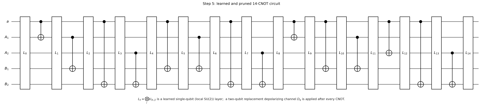
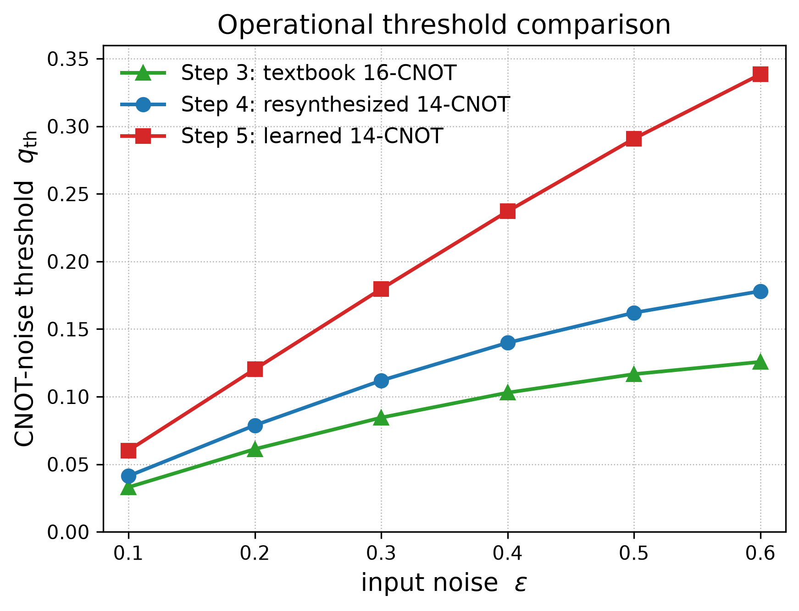

# Step 5 — Learned & pruned 14-CNOT implementation with per-CNOT noise

> Branch of **PQEC Operational Threshold**. The best-performing circuit of the study:
> same unitary, same CNOT count as Step 4, but **~1.5–1.9× the threshold**.

## What this branch is about

A parameterized circuit is trained on the full-unitary cost

```
δ_U = 1 − |Tr(U_PQEC† V)|² / 32²
```

Three ingredients make a generic RX-RY-RZ PQC compile the gadget exactly:

1. **gadget-matched connectivity** `(0,1)(0,3)(1,3)(0,2)(0,4)(2,4)` — ancilla to both
   registers + the swap pairs. A linear chain `0-1-2-3-4` cannot express `U` even at 20 CNOTs.
2. **a full RX,RY,RZ layer after *every* CNOT** (not just between blocks)
3. **enough depth**: `L=1` (6 CNOT) `δ=0.86` → `L=2` (12) `0.44` → **`L=3` (18) `δ≈3e-15`, exact**

Greedy pruning then gives **18 → 14 CNOTs, still exact**; **13 is unreachable** (every single
removal leaves `δ ≥ 0.146`). Learn-then-prune and peephole optimisation independently converge
to 14.



Written in merged form `V₅ = L₁₄C₁₄L₁₃⋯L₁C₁L₀` with `L_k = ⊗_j U_(k,j)`; the exact CNOT
sequence is

```
(0,1) (1,3) (0,4) (2,4) (0,3) (1,3) (0,4) (2,4) (0,1) (0,3) (1,3) (0,2) (0,4) (2,4)
```

Noise model identical to Steps 3–4: `D_q` after every CNOT, single-qubit gates ideal.

## Numerical results — the arrangement, not the count, sets the threshold

| check | result |
|--|--|
| `q = 0` read-out vs `F_exact` | 8.9e-16 (14-CNOT circuit is exact) |
| `F(q)` monotone decreasing | max upward step −0.0099 |

**Threshold `q_th`:**

| input ε | 0.10 | 0.20 | 0.30 | 0.40 | 0.50 | 0.60 |
|--|--|--|--|--|--|--|
| Step 3 (16) | 0.0330 | 0.0612 | 0.0845 | 0.1029 | 0.1167 | 0.1257 |
| Step 4 (14) | 0.0413 | 0.0788 | 0.1119 | 0.1399 | 0.1621 | 0.1780 |
| **Step 5 (14)** | **0.0602** | **0.1203** | **0.1797** | **0.2371** | **0.2908** | **0.3384** |
| vs Step 4 | 1.46× | 1.53× | 1.61× | 1.70× | 1.79× | **1.90×** |



Both Step-4 and Step-5 circuits are **exact 14-CNOT realizations of the same unitary**, yet
their thresholds differ by up to 1.9× — so **CNOT count alone does not set the operational
threshold; the arrangement does**, with ~2× of room at fixed count. The robustness is
*emergent*: the circuit was trained and pruned noise-free.

*Caveats*: one specific pruned solution; 14-as-floor is strong convergent evidence within this
ansatz family, not a universal minimality proof.

## Core files

| file | role |
|--|--|
| `pqc_common.py` | target `U`, ansatz, fast numpy unitary + **exact analytic gradients**, LHST cost, noisy executor |
| `pqc_ring_ansatz.py` | gadget-matched ansatz that compiles `U` exactly at 18 CNOTs |
| `pqc_ring_prune.py` | greedy CNOT pruning 18 → 14 (exact) |
| `reach13.py` | rigorous test that 13 CNOTs is unreachable |
| `pqc_ring_threshold.py` | CNOT-noise threshold vs Step 3 / Step 4 / destructive |
| `PQC_APPROX.md` | full write-up |
| `pqc_ring_pruned_params.npy`, `pqc_ring_pruned.json` | **the learned 14-CNOT solution** |

## Reproduce

```bash
git switch step-5-learned-14cnot
python pqc_ring_threshold.py   # threshold of the learned 14-CNOT gadget (uses saved params)
python draw_pqc_5abc.py        # circuit diagrams + analytic gate-list spec
python pqc_ring_ansatz.py      # (optional) retrain the ansatz from scratch
python pqc_ring_prune.py       # (optional) redo the 18 → 14 pruning
```

The pruned solution is committed, so the threshold and figure scripts run without retraining.

## Relation to the other steps

Same unitary and noise model as Steps 3–4. Auxiliary relaxations (isometry → also 14 CNOTs;
observable → 5 CNOTs; destructive read-out → 2 CNOTs) are documented in `PQC_APPROX.md` but are
**not** part of the main linear flow. The repeated-round behaviour of this circuit is studied on
the `iterated-noisy-pqec` branch.

## Branch map

| branch | contents |
|--|--|
| [`main`](../../tree/main) | integrated project: all steps, comparison code, full write-ups, paper figures |
| [`setup-bell-input`](../../tree/setup-bell-input) | Setup — Bell-isotropic input `ρ_t` preparation + verification |
| [`step-1-ideal-pqec`](../../tree/step-1-ideal-pqec) | Step 1 — ideal one-round PQEC baseline |
| [`step-2-fredkin-noise`](../../tree/step-2-fredkin-noise) | Step 2 — CSWAP-level global replacement depolarizing noise |
| [`step-3-textbook-16cnot`](../../tree/step-3-textbook-16cnot) | Step 3 — textbook 16-CNOT implementation, per-CNOT noise |
| [`step-4-resynthesized-14cnot`](../../tree/step-4-resynthesized-14cnot) | Step 4 — resynthesized 14-CNOT implementation, per-CNOT noise |
| [`step-5-learned-14cnot`](../../tree/step-5-learned-14cnot) | Step 5 — learned & pruned 14-CNOT implementation, per-CNOT noise |
| [`iterated-noisy-pqec`](../../tree/iterated-noisy-pqec) | repeated-round study: fixed points of the effective nonlinear map |
| [`archive-branched-substeps`](../../tree/archive-branched-substeps) | snapshot before the Step renumbering (old 3a/3b/4a/4b/5a/5b/5c labels) |

Every step branch is a **full copy** of the project (so it is independently checkout-able and
runnable); this README describes what *this* branch is for, and `STEP_GUIDE.md` lists its
inputs, noise model, scripts and outputs.

## Conventions used throughout

- input `ρ_t = ¼[II + t(XX − YY + ZZ)]`, `t = 1 − ε`; target `Φ = |Φ⁺⟩⟨Φ⁺|`; `F_bare = (1+3t)/4`
- wire ordering `(a, A₁, A₂, B₁, B₂) = (0,1,2,3,4)`: ancilla, retained register `A`, discarded `B`
- read-out `F = ⟨Z_a ⊗ O⟩ / ⟨Z_a⟩ = Tr(Oρ²)/Tr(ρ²)` (ancilla-parity correlator)
- **all single-qubit gates are ideal**; noise is applied only where the step's model says

## Setup

```bash
python -m venv .venv && source .venv/bin/activate
pip install -r requirements.txt
```

