# PQEC Operational Threshold

Studying the **operational error threshold** of Purification Quantum Error
Correction (PQEC) for **entanglement distillation**.

The paper this builds on

> J. Raghoonanan & T. Byrnes, *Quantum Error Correction by Purification*,
> arXiv:2603.11568 (2026)

analyzes PQEC by applying a noise channel to the **data** and then a **perfect**
purification step. Real PQEC hardware — above all the 3-qubit controlled-SWAP
(Fredkin) at the heart of the SWAP test — is itself noisy. The goal of this
project is to go beyond the ideal-gadget analysis and find the threshold on the
**noise of the PQEC operations themselves** below which purification still
**recovers entanglement**.

This repository is being built up step by step. It starts from the noisy input
state and the tooling to certify it, before adding the (noisy) purification gadget.

## Status

| Step | Item | State |
|------|------|-------|
| 1 | Noisy input state `ρ_ε` — genuine preparation circuit + verification | **done** |
| 2 | Purification (SWAP-test) gadget — ideal, verified on `ρ_ε` | **done** |
| 3a | Fredkin **global** depolarizing — analytic benchmark (no threshold) | **done** |
| 3b | **Decomposed** Fredkin, **CNOT-only** noise — operational threshold `ε₂*` | **done** |
| 4a | Unitary-preserving CNOT reduction (16→14, verified) + CNOT-noise threshold (1.25–1.42× over 16-CNOT) | **done** |
| 4b | Destructive/VD gadget (2 CNOTs), closed form, ~2.7–4.4× higher threshold | **done** |
| 5a | Variational (PQC) compiling of the gadget unitary — **exact at 18 CNOTs** (gadget-matched RX-RY-RZ ansatz); prunes to **14** (=Step 4a; 13 impossible); learned 14-CNOT threshold **~1.5–1.9× Step 4a** | **done** |
| 5b | Ancilla-`\|0⟩` isometry compiling — same-ansatz learn-then-prune floor is also **14** (relaxing to the coherent state saves no CNOTs) | **done** |
| 5c | Purified observable — noise-aware training (specialized estimator); same-ansatz prune of the 14-CNOT circuit under the ancilla-parity cost floors at **5** (structured destructive = 2) | **done** |

## The noisy input state

The noisy input is the isotropic (global-depolarizing) Bell state

```
ρ_ε = (1 − ε) |Φ⁺⟩⟨Φ⁺| + ε · I/4,      |Φ⁺⟩ = (|00⟩ + |11⟩)/√2.
```

It is prepared by a genuine mixed-state circuit — `H · CNOT` to build `|Φ⁺⟩`,
then a **global 2-qubit depolarizing channel** of strength `ε` (a single
`QubitChannel` with the 16 two-qubit-Pauli Kraus operators):

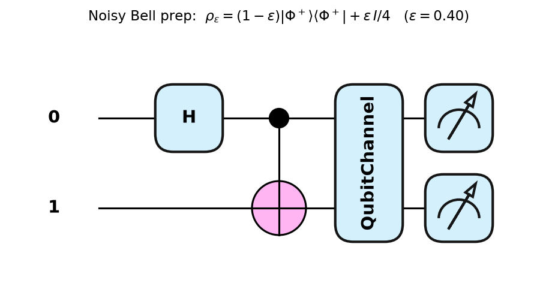

Key closed forms (all checked by the verification code):

- fidelity `F = ⟨Φ⁺|ρ_ε|Φ⁺⟩ = 1 − 3ε/4`
- Bell-basis spectrum: `|Φ⁺⟩ → 1 − 3ε/4`, the three other Bell states → `ε/4` each
- purity `Tr(ρ_ε²) = (1 − 3ε/4)² + 3(ε/4)²`
- `ρ_ε` is entangled iff `F > 1/2`, i.e. `ε < 2/3`

## The purification gadget (Step 2)

The PQEC primitive is the **SWAP-test gadget**: two identical noisy copies
`ρ ⊗ ρ` enter, an ancilla-controlled SWAP (for the 2-qubit register, two parallel
Fredkin gates) is applied, and reading the ancilla extracts the purified component

```
P(ρ) = ρ² / Tr[ρ²]        (concentrates weight on the dominant eigenvector)
```

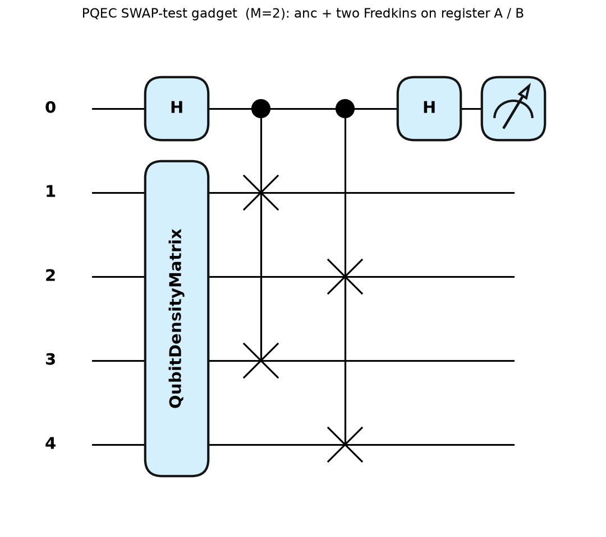

The gadget is implemented as a genuine 5-wire circuit with two equivalent
read-outs (both used when the gadget is made noisy in Step 3):

- **state extraction** (Eq. 9): `ρ² = (ancilla |0⟩ block) − (|1⟩ block)`, so
  `purify_once(ρ)` returns `ρ²/Tr[ρ²]`;
- **observable / parity correlator** (the paper's actual protocol):
  `⟨O⟩_purified = ⟨Z⊗O⟩ / ⟨Z⊗I⟩ = Tr(Oρ²)/Tr(ρ²)`.

Both are verified to machine precision (`~1e-16`) on 500 random states and on `ρ_ε`.

On the isotropic input `ρ_ε`, `|Φ⁺⟩` is the strictly dominant eigenvector for
**every `ε < 1`** (eigenvalues `1−3ε/4` vs `ε/4`), so the ideal gadget restores
fidelity and entanglement to 1 for all `ε < 1` — it even **re-entangles a
separable input** (`2/3 ≤ ε < 1`); only `ρ = I/4` at `ε = 1` is a fixed point.

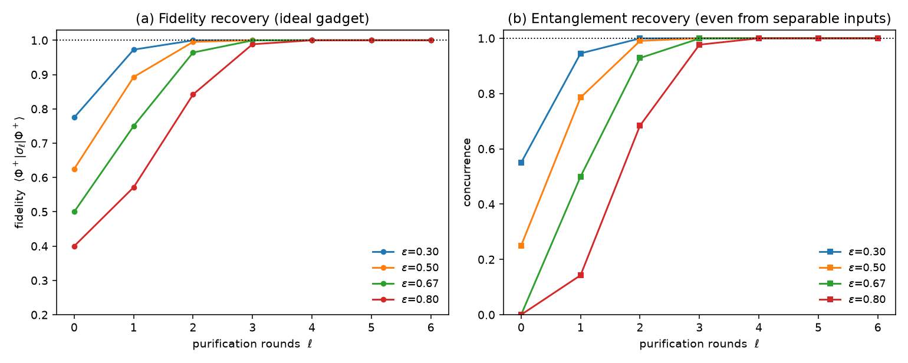

## Noise on the gadget (Step 3a): Fredkin global depolarizing

First noisy-gadget model — right after each Fredkin, a **3-qubit global
depolarizing channel** of strength `g_F` on the three qubits it touched (ancilla
included): `G(σ) = (1−g_F)σ + g_F (I₈/8)⊗Tr_S(σ)`.

**Result: this model self-mitigates — signal loss, no threshold.** Both parity
correlators scale by `(1−g_F)²`, which cancels in the ratio, so the purified
fidelity is *independent* of `g_F` for `0 ≤ g_F < 1`:

```
F_PQEC(p, g_F) = (1+3α²)² / (4(1+3α⁴)) = F_ideal-PQEC(p),   α = 1−4p/3  (α² = 1−ε).
```

The only cost is a sampling-overhead divergence `N_samp ∼ (1−g_F)^{-4}`. All the
analytic formulas (numerator/denominator, `F_PQEC`, `F_bare`, `ΔF`, sampling) are
verified against the circuit to `~1e-13`. A hand derivation
(ordering `(a,A1,A2,B1,B2)`, closed forms after every gate) is reproduced
step-by-step by the circuit to `~1e-16` in `verify_note_states.py`.

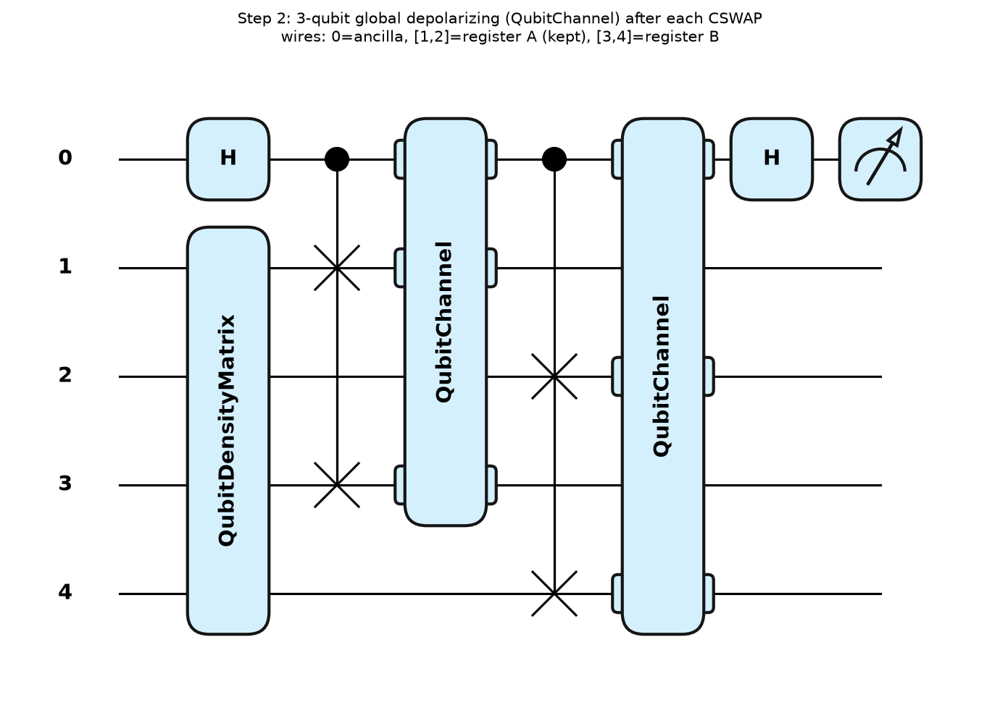

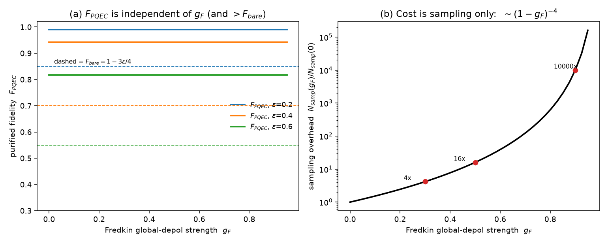

A real operational threshold needs noise that attenuates numerator and denominator
**asymmetrically** (e.g. noise on the CNOTs of a decomposed Fredkin) — that is
Step 3b.

## CNOT noise on a decomposed Fredkin (Step 3b)

> Full write-up with variable definitions and the theory/implementation split:
> **[`CNOT_NOISE_ANALYSIS.md`](CNOT_NOISE_ANALYSIS.md)**.

We **assume the CNOTs are the noisy operations and the single-qubit gates are ideal.**
Decompose each Fredkin into native gates — textbook
`CSWAP(q;a,b) = CNOT(b→a)·Toffoli(q,a;b)·CNOT(b→a)` with the Clifford+T Toffoli
(6 CNOT), so **1 Fredkin = 8 CNOTs** and **16 CNOTs** per round — and put a two-qubit
depolarizing `ε₂` (replacement, `(1−ε₂)ρ + ε₂ I/4`) after each CNOT. Sanity: `ε₂=0`
reproduces the ideal gadget to `~1e-15`. (Optimized decompositions — 5 two-qubit gates
Smolin–DiVincenzo PRA 53, 2855 (1996); 7-CNOT Cruz–Murta arXiv:2305.18128 — are a
possible follow-up under the same model.)

**Result: a finite operational threshold `ε₂*` appears.** Unlike the 3-qubit global
depolarizing of Step 3a (which cancels in the ratio), CNOT noise attenuates the parity
numerator and denominator by **different** `t`-dependent factors, so `F` falls with
`ε₂` and crosses the no-QEC baseline at a finite `ε₂*`. Exact closed form (verified on
the circuit to `~1e-14`), with `v = 1−ε₂` and `t = 1−ε`:

```
F_dec = ¼[ 1 + t(1+t)(v⁵+5v⁶)/(1+3v⁴t²) ] ,   numerator C(v)=v⁵+5v⁶ ,  D(v,t)=1+3v⁴t² .
```

Input `t = 1−ε` (global Bell-depolarizing input `ρ_ε`) or `(1−4p/3)²` (local
depolarizing `p` per Bell qubit) — same isotropic family. A noisy CNOT also turns the
isotropic input into an **anisotropic** Bell-diagonal effective state (`c_z > c_⊥`).
The CNOT-only threshold `ε₂*`:

| input `ε` | 0.10 | 0.20 | 0.30 | 0.40 | 0.50 | 0.60 |
|-----------|------|------|------|------|------|------|
| `ε₂*`     | 0.033 | 0.061 | 0.085 | 0.103 | 0.117 | 0.126 |

The threshold `ε₂*` is the root of `(1+t)(v⁵+5v⁶) = 3(1+3v⁴t²)` (`t = 1−ε`); it
**grows with input noise** (a noisier input has more to gain, so it tolerates
noisier CNOTs) and stays **well above realistic hardware CNOT error** (`~10⁻²`) for
inputs beyond `ε ≈ 0.03`. Near `ε₂=0` the slope is `K₂ = t(1+t)(33t²+35)/(4(1+3t²)²)`
(`→ 17/8` for a clean input). Computed and verified against the circuit
(`~1e-14`) in [`pqec_cnot_threshold.py`](pqec_cnot_threshold.py):

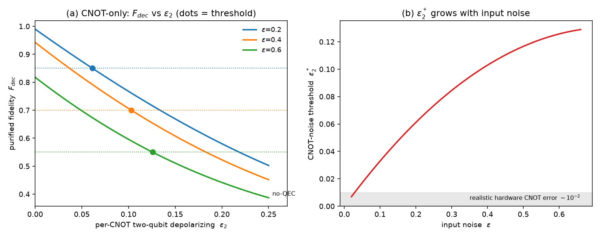

The three circuits ([`draw_cnot_noise.py`](draw_cnot_noise.py)):

**1. The CSWAP (Fredkin) decomposition** — `CSWAP(0;1,2) = CNOT(2→1)·Toffoli(0,1;2)·CNOT(2→1)` (Clifford+T Toffoli; 8 CNOTs):

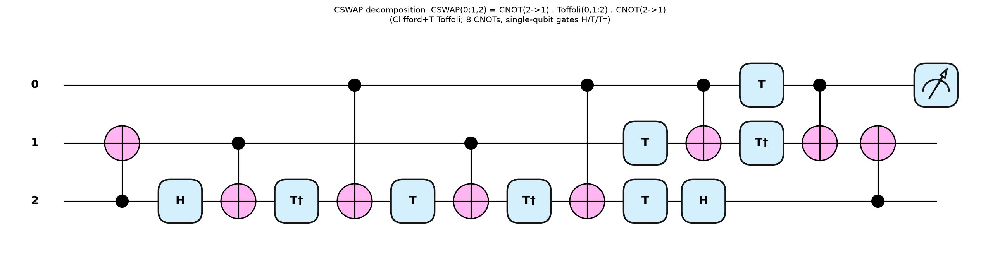

**2. The full SWAP test using that decomposition** (ideal). Barriers separate
`state prep | CSWAP₁ | CSWAP₂ | final H` (wires: 0 = ancilla, [1,2] = kept
register A, [3,4] = discarded register B):

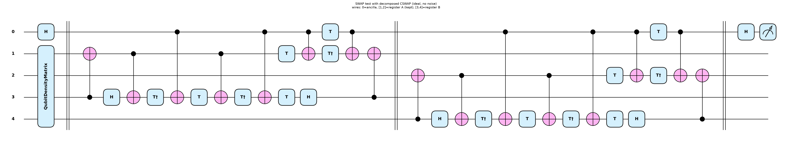

**3. The same SWAP test with a two-qubit depolarizing channel after each CNOT**
(single-qubit gates left ideal):

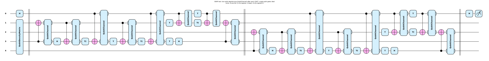

### Reducing the gadget's CNOT count (Step 4)

Full write-up: **[`SWAP_GADGET_OPTIMIZATION.md`](SWAP_GADGET_OPTIMIZATION.md)**.

**Why bother.** The two Fredkins decompose into **16 CNOTs**, and CNOTs are where the
gate noise lives. Can we do the *same job* with fewer CNOTs? "Same job" has two
meanings, and we did both.

**Step 4a — keep the exact circuit** ([`resynthesize_gadget.py`](resynthesize_gadget.py)).
The gadget `H·CSWAP·CSWAP·H` is a fixed 5-qubit unitary. Two peephole optimizers
(Qiskit, pytket) reduce it **16 → 14 CNOTs**, each checked to implement the *identical*
unitary. `14 = 2×7` (the per-Fredkin optimum). Safe but modest — the coherent gadget is
unchanged. (14 is what the tools found, not a proven minimum.)

The machine-optimized 14-CNOT circuit, re-implemented **identically in PennyLane**
([`draw_resynth_pl.py`](draw_resynth_pl.py); wire `0` = ancilla, `1,2` = kept register
`A`, `3,4` = discarded `B`) — the `U3` boxes are single-qubit rotations (angles in
radians), the 14 dot + ⊕ links are the CNOTs. The threshold analysis inserts a 2-qubit
depolarizing `ε₂` after each CNOT:

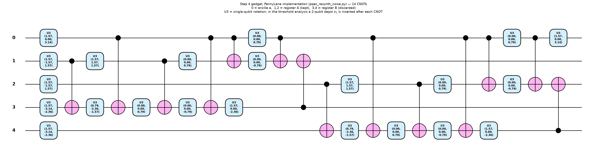

*Threshold (computed, not assumed).* This exact 14-CNOT circuit is re-implemented
identically in PennyLane ([`pqec_resynth_noise.py`](pqec_resynth_noise.py); overlap with
`U` = `1.000000000000`, `ε₂=0` read-out matches `Tr(Oρ²)/Tr(ρ²)` to `1e-16`) and given a
per-CNOT depolarizing `ε₂` (single-qubit gates ideal). Its threshold is **1.25–1.42×
higher** than the 16-CNOT textbook — *more* than the naive `16/14` count ratio, so the
machine-found layout also propagates noise a bit more favourably:

| input `ε` | 0.10 | 0.20 | 0.30 | 0.40 | 0.50 | 0.60 |
|-----------|------|------|------|------|------|------|
| textbook cSWAP (16) `ε₂*` | 0.033 | 0.061 | 0.085 | 0.103 | 0.117 | 0.126 |
| **Step 4a (14) `ε₂*`** | **0.041** | **0.079** | **0.112** | **0.140** | **0.162** | **0.178** |

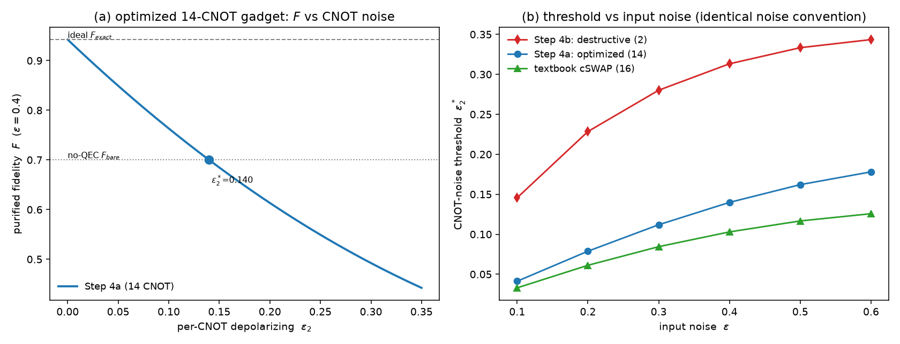

**Step 4b — keep only the answer** ([`destructive_gadget.py`](destructive_gadget.py)).
PQEC never needs the SWAP *unitary* — it needs one number, `F = Tr(Oρ²)/Tr(ρ²)`, which
is the **expectation value of the SWAP operator** on the two copies. Instead of
*applying* a controlled-SWAP (16 CNOTs), you can *measure* SWAP directly: rotate each
qubit-pair into the SWAP eigenbasis with a **Bell-basis change** (one `CNOT + H` per
pair) and read out. No ancilla, no controlled-SWAP — just **2 CNOTs**:

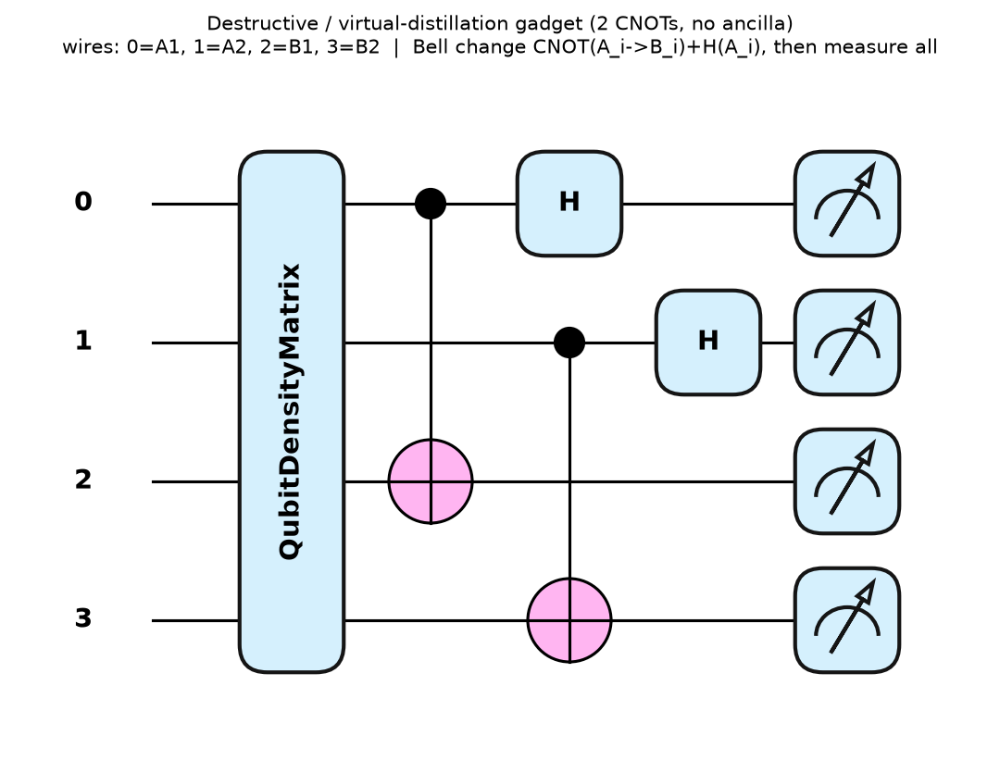

Reading it (wires `0=A1, 1=A2, 2=B1, 3=B2`; the two noisy copies enter as
`QubitDensityMatrix`): the two pink `⊕` are `CNOT(A1→B1)` and `CNOT(A2→B2)`; with the
`H`s they form the Bell-basis change, then all four qubits are measured and combined
classically.

**Result.** This gives *exactly* the same `F` as the controlled-SWAP gadget — verified
to `2e-16` for the fidelity projector **and** a generic Pauli — with the closed form

```
F_dest(t, ε₂) = (1 + 6 s² t + 9 s² t²) / (4 (1 + 3 s² t²)),   threshold  ε₂* = 1 − 1/√(2 + 2t − 3t²)
```

(`s = 1−ε₂`, `t = 1−ε`). Because only **2 CNOTs carry noise instead of 16**, its
CNOT-noise threshold is **~2.7–4.4× higher** (left: fidelity vs per-CNOT noise;
right: threshold vs input noise):

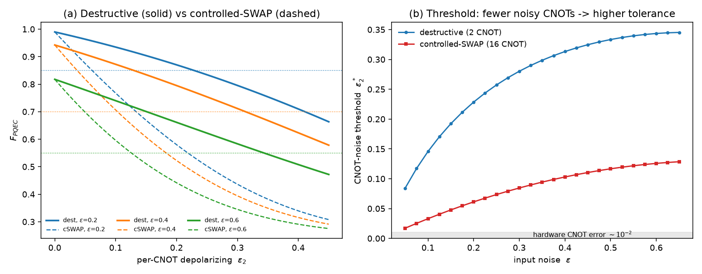

**Honest fine print.** (i) the `~2.7–4.4×` is a *mean-fidelity* threshold at fixed
per-CNOT `ε₂`; total sampling cost also depends on how many measurements you take;
(ii) only the denominator `Tr(ρ²)` comes from one Bell measurement — a general numerator
needs several Pauli measurement **settings** (each still a 2-CNOT circuit), so "2 CNOTs"
is a *per-setting* cost; (iii) the destructive gadget is **measurement-only** (returns
`⟨O⟩`, not a coherent purified state) — an alternative *measurement* of the
virtual-distillation estimator, matching the paper's VD framing.

### Approximating the gadget with a trained PQC (Step 5)

Full write-up: **[`PQC_APPROX.md`](PQC_APPROX.md)**.

Step 4 reduced the CNOT count *exactly*. Step 5 asks the *learned* version: can a
parameterized quantum circuit (PQC) be **trained** to play the gadget's role with
fewer CNOTs? As in Step 4, "role" has a ladder of meanings, and we did all three —
reproduce the **unitary** (5a), the **ancilla-`|0⟩` isometry** on the physical input
(5b), or just the purified **observable**, noise-aware (5c). The ansatz has a CNOT
budget `B` as its knob; the same ansatz runs as a fast numpy unitary (5a/5b) and as a
noisy `default.mixed` circuit (5c), verified identical to machine precision.

**Steps 5a/5b — an expressibility/trainability squeeze.** Compiling the gadget
*unitary* (5a) or *isometry* (5b) from scratch fails: with **exact** analytic
gradients, many restarts, the plateau-mitigating **LHST** local cost, and rich ansätze
up to **375 params / 24 CNOTs**, the best infidelity floors around `δ ≈ 0.44` (5a) /
`0.29` (5b). A **teacher–student** test (`test_inclass.py`) pins down *why* — recompile
a target that is reachable by construction, and see if the optimizer finds it:

- `B=12`: reachable targets recompile to `~1e-15` (optimizer is fine), yet `U` is
  unreached → **expressibility** (this fixed CNOT topology can't hold `U` at 12);
- `B=20`: even reachable targets fail (`δ≈0.8`) → genuine **barren-plateau/trainability**
  barrier (`B=16` is the transition).

So where the ansatz is *trainable* it isn't *expressive enough*, and where it might be
expressive the optimizer can't navigate — a squeeze **specific to these generic
ansätze**. Crucially this is an ansatz limitation, **not** a claim the gadget is
uncompilable — with the right ansatz it *does* compile (next). 5b is consistently
easier than 5a — the same relaxation ladder as Step 4.

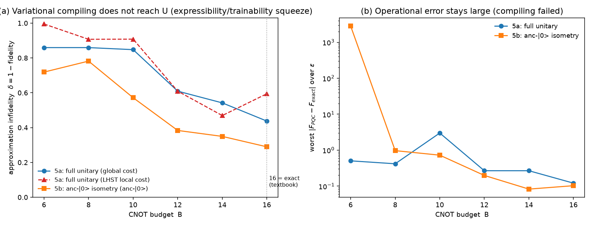

**Step 5a — it CAN be done with the right ansatz** ([`pqc_ring_ansatz.py`](pqc_ring_ansatz.py)).
The obstruction above was the ansatz. Fixing three things makes an RX-RY-RZ PQC compile
`U` to machine precision:
1. **gadget-matched connectivity** `(0,1)(0,3)(1,3)(0,2)(0,4)(2,4)` — ancilla to both
   registers + the swap pairs (a linear chain `0-1-2-3-4` cannot express `U` even at
   20 CNOTs; the teacher–student test shows this is expressibility);
2. a **full RX,RY,RZ layer after *every* CNOT** (not just between blocks);
3. enough depth: `L=1` (6 CNOT) `δ=0.86`, `L=2` (12) `0.44`, **`L=3` (18) `δ≈3e-15` — exact.**

**Pruning to 14** ([`pqc_ring_prune.py`](pqc_ring_prune.py)). Greedily removing CNOTs
from the exact 18-CNOT solution (warm-started) reaches **14 CNOTs, still exact** — the
*same* count as Step 4a and the `2×7` per-Fredkin optimum. **13 is unreachable**: every
single removal leaves `δ ≥ 0.15` ([`reach13.py`](reach13.py)). So learn-then-prune and
peephole optimization independently converge to 14.

**The arrangement — not the count — sets the noise threshold**
([`pqc_ring_threshold.py`](pqc_ring_threshold.py)). Putting `ε₂` on each of the learned
14 CNOTs (single-qubit gates ideal) gives a threshold **~1.5–1.9× higher than Step 4a's
14-CNOT circuit**, nearly reaching the 2-CNOT destructive gadget at high input noise —
even though both are exact 14-CNOT realizations of the same `U`:

| input `ε` | textbook (16) | Step 4a (14) | **learned (14)** | dest (2) |
|-----------|:---:|:---:|:---:|:---:|
| 0.10 | 0.033 | 0.041 | **0.060** | 0.146 |
| 0.40 | 0.103 | 0.140 | **0.237** | 0.313 |
| 0.60 | 0.126 | 0.178 | **0.338** | 0.343 |

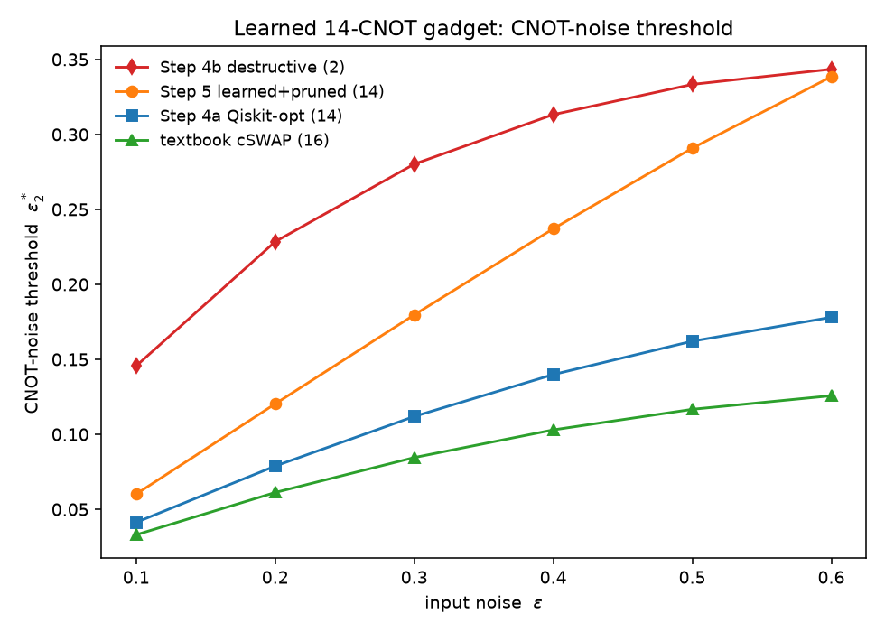

So CNOT **count alone does not set the operational threshold — the arrangement does**,
with ~2× of room at fixed count. (The robustness is emergent: the circuit was trained
and pruned noise-free.)

**The relaxation ladder on one footing (5a / 5b / 5c).** Running the *same*
learn-then-prune down the weaker targets shows *where* CNOT savings appear. The isometry
([`pqc_ring_5b.py`](pqc_ring_5b.py)) prunes to **14** — the same as the full unitary, so
relaxing unitary → coherent-state saves nothing. Only relaxing to the **observable**
([`pqc_ring_5c.py`](pqc_ring_5c.py), pruning the 14-CNOT circuit under the ancilla-parity
correlator cost) collapses the count to **5**, and the structured destructive read-out
(Step 4b) reaches **2**:

| rung | target | min CNOTs |
|--|--|:--:|
| 5a | full unitary `U` | **14** (13 impossible) |
| 5b | ancilla-`\|0⟩` isometry `U₀` | **14** (= 5a) |
| 5c | observable `F`, ancilla-parity | **5** |
| — | observable `F`, structured destructive (Step 4b) | **2** |

This reproduces the Step-4 lesson by training: **relax the requirement to the observable,
not to the state.**

**Step 5c — noise-aware observable training (the useful route).** Relaxing to the
operational scalar `F(ε)` (matched for `O ∈ {|Φ⁺⟩⟨Φ⁺|, ZZ}`) is a low-dimensional,
plateau-free target that trains easily at a **small** budget (`B=6`). To avoid a
degeneracy we match the ancilla-parity **correlators** `⟨Z_a⟩ = Tr(ρ²)` and
`⟨Z_a⊗O⟩ = Tr(Oρ²)` (matching only the ratio `F` lets the optimizer drive the
denominator to zero and fake any value, even `F > 1`).

**Scope (out-of-sample check).** `θ_free` generalizes across the *input family* —
over a dense unseen `ε` grid it matches `F_exact` to `0.0014` (`Φ⁺`) / `0.0021` (`ZZ`)
— but **not across observables**: unseen `XX, YY` are off by `~0.13`. So it is a
**learned estimator specialized to the Bell-isotropic inputs and `{Φ⁺, ZZ}`**, not a
general observable-equivalent gadget (Step 4b is exact for all `O`). The threshold
uses `O = Φ⁺` only and `F(ε₂)` is verified monotone, so the numbers below stand.

**Positive result — fewer CNOTs lift the threshold.** `θ_free` matches `F_exact(ε)` to
`~0.001` at `B = 6` CNOTs, and deployed under CNOT noise it **beats the 16-CNOT
textbook** at every input noise, approaching the exact 2-CNOT Step-4b reference:

| input `ε` | 0.10 | 0.20 | 0.30 | 0.40 | 0.50 | 0.60 |
|-----------|------|------|------|------|------|------|
| textbook cSWAP (16) `ε₂*` | 0.033 | 0.061 | 0.085 | 0.103 | 0.117 | 0.126 |
| **PQC `θ_free` (6) `ε₂*`** | **0.051** | **0.100** | **0.148** | **0.194** | **0.236** | **0.273** |
| Step 4b destructive (2) `ε₂*` | 0.146 | 0.229 | 0.280 | 0.313 | 0.333 | 0.343 |

**Negative result — noise-aware training adds nothing (here).** Baking the CNOT noise
into the loss gives **no threshold gain** for the objectives we tried: matching the
ratio `F` is denominator-degenerate, and matching the absolute correlators is
misaligned with the ratio (and collapses to an input-independent solution at strong
noise). This is consistent with the noise being **unital** (it can't be *inverted* by
unitary re-parameterization) — but it is an **empirical negative, not a proof of
impossibility**: other objectives (e.g. a denominator-constrained margin objective) we
did not try. On this problem **the win is structural (fewer CNOTs), as in Step 4** —
reinforcing that the destructive Step-4b gadget, not a learned one, is the right
low-CNOT tool.

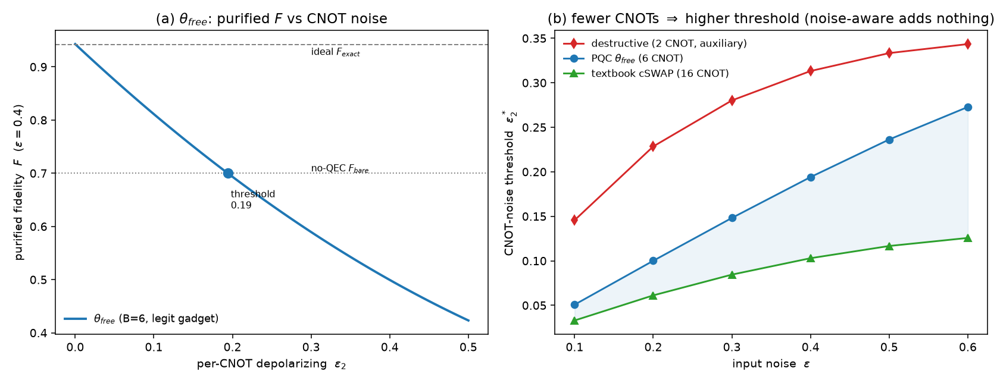

## Files

| File | Description |
|------|-------------|
| [`noisy_bell_state.py`](noisy_bell_state.py) | Prepares `ρ_ε` with a genuine circuit and `verify(eps)` — checks the analytic match, unit trace, Hermiticity, positive-semidefiniteness, the Bell spectrum, fidelity and purity |
| [`draw_noisy_bell.py`](draw_noisy_bell.py) | Draws the preparation circuit (`circuit_noisy_bell.png`) |
| [`pqec_gadget.py`](pqec_gadget.py) | Ideal SWAP-test gadget: `purify_once` / `purify_rounds` / `obs_purified`, verification, and the `ρ_ε` recovery demo |
| [`draw_pqec_gadget.py`](draw_pqec_gadget.py) | Draws the 5-wire gadget (`circuit_pqec_gadget.png`) |
| [`pqec_gadget_noise.py`](pqec_gadget_noise.py) | Fredkin **global** depolarizing `g_F`: noisy gadget, `obs_pqec_noisy`, effective state |
| [`draw_gadget_noise.py`](draw_gadget_noise.py) | Draws the Step 3a gadget (`circuit_gadget_noise.png`) |
| [`verify_analytic_global_depol.py`](verify_analytic_global_depol.py) | Verifies the analytic global-depol formulas against the circuit (`~1e-13`) |
| [`verify_note_states.py`](verify_note_states.py) | Reproduces the note's step-by-step states (`σ₀…σ_out`) on the circuit (`~1e-16`) |
| [`plot_global_depol_benchmark.py`](plot_global_depol_benchmark.py) | `F_PQEC` flatness + sampling divergence figure (`global_depol_benchmark.png`) |
| [`verify_analytic_decomposed.py`](verify_analytic_decomposed.py) | Verifies the CNOT-only analytic `A/B/F_dec` and the `K₂` slope against the genuine decomposed circuit (`~1e-14`) |
| [`draw_cnot_noise.py`](draw_cnot_noise.py) | Draws the CNOT-only diagrams: CSWAP decomposition, SWAP test, and SWAP test with 2-qubit depol after each CNOT (barrier-separated stages) |
| [`pqec_cnot_threshold.py`](pqec_cnot_threshold.py) | CNOT-only threshold `ε₂*` (single-qubit gates ideal): closed forms (`F`, `Q`, `N_Φ`, `c_⊥`, `c_z`), circuit checks incl. effective-state anisotropy, threshold table + figure |
| [`CNOT_NOISE_ANALYSIS.md`](CNOT_NOISE_ANALYSIS.md) | Full CNOT-only note: notation/variable definitions, theory (Part I), implementation & verification (Part II) |
| [`resynthesize_gadget.py`](resynthesize_gadget.py) | Step 4a: unitary-preserving CNOT reduction of the gadget (Qiskit/pytket, 16→14, verified) |
| [`draw_resynth_pl.py`](draw_resynth_pl.py) | Draws the PennyLane implementation of the Step-4a 14-CNOT circuit (`circuit_resynth_pennylane.png`) |
| [`pqec_resynth_noise.py`](pqec_resynth_noise.py) | Step 4a **threshold**: pure-PennyLane replay of the 14-CNOT circuit (unitary-verified) + CNOT-noise threshold vs textbook/4b (`pqec_resynth_threshold.png`) |
| [`destructive_gadget.py`](destructive_gadget.py) | Step 4b: destructive/VD gadget (2 CNOTs) — ideal-equivalence proof, closed form, CNOT-noise threshold vs controlled-SWAP; draws `circuit_destructive.png` + `destructive_gadget.png` |
| [`SWAP_GADGET_OPTIMIZATION.md`](SWAP_GADGET_OPTIMIZATION.md) | Write-up of both CNOT-reduction routes (same-unitary 16→14; same-observable 2 CNOTs) |
| [`pqc_common.py`](pqc_common.py) | Step 5 shared: target `U`, PQC ansatz, fast numpy unitary + **exact** gradients, LHST cost, PennyLane noisy executor, read-out, references (self-test) |
| [`pqc_compile.py`](pqc_compile.py) | Step 5a/5b: variational compiling sweep (global + LHST costs); figure `pqc_compile_pareto.png` |
| [`pqc_noise_aware.py`](pqc_noise_aware.py) | Step 5c: noise-aware observable training + threshold comparison; figure `pqc_noise_aware.png` |
| [`test_inclass.py`](test_inclass.py) | teacher–student test: in-class recompilation isolating expressibility vs trainability by depth |
| [`test_5c_oos.py`](test_5c_oos.py) | Step-5c out-of-sample check (unseen observables, dense `ε`, `F(ε₂)` monotonicity) |
| [`pqc_ring_ansatz.py`](pqc_ring_ansatz.py) | Step 5a **success**: RX-RY-RZ ansätze; the gadget-matched, per-CNOT-rotation ansatz that compiles `U` exactly at 18 CNOTs; saves `pqc_ring_L3_params.npy` |
| [`pqc_ring_prune.py`](pqc_ring_prune.py) | Greedy CNOT pruning of the 18-CNOT solution → **14** (exact); saves `pqc_ring_pruned_*.{npy,json}` |
| [`reach13.py`](reach13.py) | Rigorous test that **13 CNOTs is unreachable** (14 is the floor here) |
| [`pqc_ring_threshold.py`](pqc_ring_threshold.py) | CNOT-noise threshold of the learned 14-CNOT gadget vs Step 4a/textbook/4b (`pqc_ring_threshold.png`) |
| [`pqc_ring_5b.py`](pqc_ring_5b.py), [`pqc_ring_5b_from14.py`](pqc_ring_5b_from14.py) | 5b rung: isometry compile + prune → floor **14** (= 5a) |
| [`pqc_ring_5c.py`](pqc_ring_5c.py) | 5c rung: prune the 14-CNOT circuit under the ancilla-parity observable cost → floor **5**; saves `pqc_ring_5c_{params.npy,.json}` |
| [`draw_pqc_ansatz.py`](draw_pqc_ansatz.py) | draws the ansatz structure (`circuit_pqc_ansatz.png`) |
| [`PQC_APPROX.md`](PQC_APPROX.md) | Step 5 write-up: three targets, the LHST derivation, the expressibility/trainability squeeze, and the noise-aware threshold result |
| [`requirements.txt`](requirements.txt) | Dependencies (pinned minimums + tested versions) |

## Setup & run

```bash
python -m venv .venv
source .venv/bin/activate          # Windows: .venv\Scripts\activate
pip install -r requirements.txt

python noisy_bell_state.py         # build ρ_ε and verify it (sweep + 500 random ε)
python draw_noisy_bell.py          # regenerate the input circuit diagram
python pqec_gadget.py              # ideal gadget: verify + ρ_ε recovery demo
python draw_pqec_gadget.py         # regenerate the gadget circuit diagram
python pqec_gadget_noise.py        # Fredkin global depol: <O> vs g_F (self-mitigates)
python draw_gadget_noise.py        # Step 3a gadget circuit diagram
python verify_analytic_global_depol.py  # analytic formulas vs circuit (~1e-13)
python verify_note_states.py       # note's step-by-step states vs circuit (~1e-16)
python plot_global_depol_benchmark.py   # F_PQEC flatness + sampling divergence figure
python verify_analytic_decomposed.py  # CNOT-only analytic A/B/F_dec + K2 slope vs circuit
python draw_cnot_noise.py          # CNOT-only diagrams (CSWAP decomp, SWAP test, +CNOT noise)
python pqec_cnot_threshold.py      # CNOT-only threshold eps2* (single-qubit gates ideal)
python destructive_gadget.py       # 2-CNOT destructive/VD gadget: equivalence + threshold vs cSWAP
python resynthesize_gadget.py      # unitary-preserving 16->14 CNOT reduction (needs qiskit/pytket)
```

### Verification output (excerpt)

```
eps = 0.200 | F = 0.8500 (=1-3eps/4=0.8500) | purity = 0.7300 | max|rho-target| = 1.67e-16 | PASS
eps = 0.500 | F = 0.6250 (=1-3eps/4=0.6250) | purity = 0.4375 | max|rho-target| = 5.55e-17 | PASS
...
500 random eps in [0,1]: max |rho - target| = 2.78e-16
ALL CHECKS PASSED
```

The circuit reproduces `ρ_ε` to machine precision (`~1e-16`) for arbitrary `ε ∈ [0,1]`.
