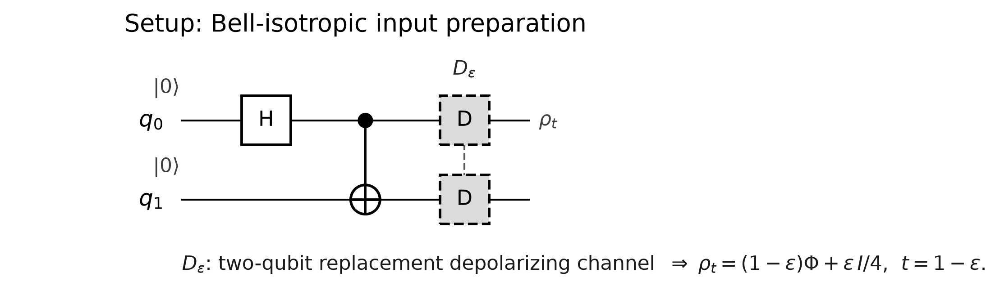

# Setup — Bell-isotropic input preparation and verification

> Branch of **PQEC Operational Threshold**. This branch is the entry point of the study:
> build the noisy input state that every later step consumes, and certify it.

## What this branch is about

The noisy input for the whole project is the isotropic (global-depolarizing) Bell state

```
ρ_t = (1 − ε)|Φ⁺⟩⟨Φ⁺| + ε·I/4 = ¼[II + t(XX − YY + ZZ)],   t = 1 − ε
```

prepared by a genuine mixed-state circuit — `H·CNOT` to build `|Φ⁺⟩`, then **one joint
two-qubit replacement depolarizing channel** `D_ε` on both qubits:

```
D_ε(ρ) = (1−ε)ρ + ε (I₄/4) Tr(ρ)
```

implemented as a single `QubitChannel` with the 16 two-qubit-Pauli Kraus operators.



## Numerical results

`verify(eps)` in `noisy_bell_state.py` checks the circuit output against the analytic target:

| check | criterion | result |
|--|--|--|
| analytic match | `max\|ρ − ρ_t\|` | **2.8e-16** (500 random ε ∈ [0,1]) |
| valid state | `Tr ρ = 1`, Hermitian, PSD | pass |
| Bell spectrum | `\|Φ⁺⟩ → 1−3ε/4`, other three → `ε/4` | pass |
| fidelity | `F = 1 − 3ε/4` | pass |
| purity | `(1−3ε/4)² + 3(ε/4)²` | pass |

Verified for `ε ∈ {0, 0.1, 0.2, ⅓, 0.5, ⅔, 0.8, 1.0}` and 500 random ε — machine precision
for arbitrary ε. `ρ_t` is **entangled iff `F > ½`, i.e. `ε < 2/3`**, the bare-input boundary
all later gadget-noise thresholds are compared against.

## Core files

| file | role |
|--|--|
| `noisy_bell_state.py` | prepares `ρ_t`, `verify(eps)`, `rho_eps_analytic`, `global_depol_kraus` |
| `draw_noisy_bell.py` | circuit diagram → `circuit_noisy_bell.png` |
| `figures/setup_bell_input.png` | paper figure |

## Reproduce

```bash
git switch setup-bell-input
python noisy_bell_state.py     # build ρ_t and verify (sweep + 500 random ε)
python draw_noisy_bell.py      # circuit diagram
```

## Relation to the other steps

`rho_eps_analytic`, `O_PHI_PLUS`, `PHI_PLUS` and `global_depol_kraus` defined here are imported
by **every** later step. Step 1 applies the ideal gadget to this state; Steps 2–5 make the
gadget noisy.

## Branch map

| branch | contents |
|--|--|
| [`main`](../../tree/main) | integrated project: all steps, comparison code, full write-ups, paper figures |
| [`setup-bell-input`](../../tree/setup-bell-input) | Setup — Bell-isotropic input `ρ_t` preparation + verification |
| [`step-1-ideal-pqec`](../../tree/step-1-ideal-pqec) | Step 1 — ideal one-round PQEC baseline |
| [`step-2-fredkin-noise`](../../tree/step-2-fredkin-noise) | Step 2 — CSWAP-level global replacement depolarizing noise |
| [`step-3-textbook-16cnot`](../../tree/step-3-textbook-16cnot) | Step 3 — textbook 16-CNOT implementation, per-CNOT noise |
| [`step-4-resynthesized-14cnot`](../../tree/step-4-resynthesized-14cnot) | Step 4 — resynthesized 14-CNOT implementation, per-CNOT noise |
| [`step-5-learned-14cnot`](../../tree/step-5-learned-14cnot) | Step 5 — learned & pruned 14-CNOT implementation, per-CNOT noise |
| [`iterated-noisy-pqec`](../../tree/iterated-noisy-pqec) | repeated-round study: fixed points of the effective nonlinear map |
| [`archive-branched-substeps`](../../tree/archive-branched-substeps) | snapshot before the Step renumbering (old 3a/3b/4a/4b/5a/5b/5c labels) |

Every step branch is a **full copy** of the project (so it is independently checkout-able and
runnable); this README describes what *this* branch is for, and `STEP_GUIDE.md` lists its
inputs, noise model, scripts and outputs.

## Conventions used throughout

- input `ρ_t = ¼[II + t(XX − YY + ZZ)]`, `t = 1 − ε`; target `Φ = |Φ⁺⟩⟨Φ⁺|`; `F_bare = (1+3t)/4`
- wire ordering `(a, A₁, A₂, B₁, B₂) = (0,1,2,3,4)`: ancilla, retained register `A`, discarded `B`
- read-out `F = ⟨Z_a ⊗ O⟩ / ⟨Z_a⟩ = Tr(Oρ²)/Tr(ρ²)` (ancilla-parity correlator)
- **all single-qubit gates are ideal**; noise is applied only where the step's model says

## Setup

```bash
python -m venv .venv && source .venv/bin/activate
pip install -r requirements.txt
```

