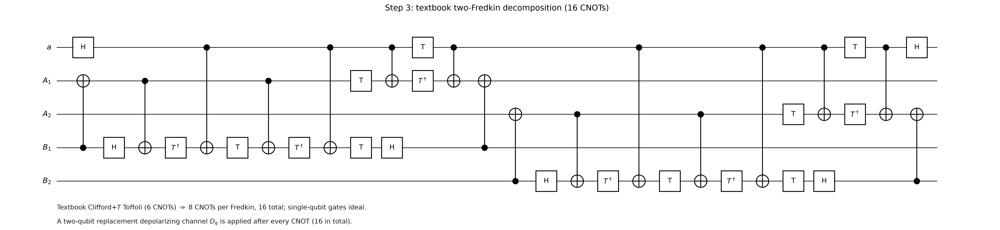
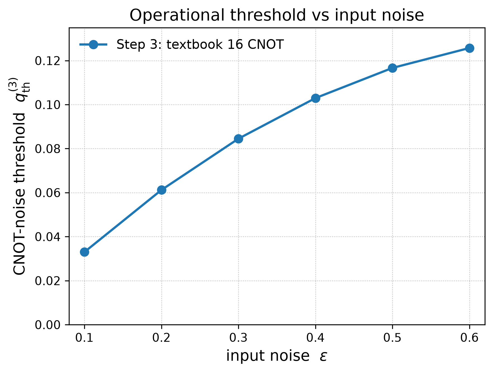

# Step 3 — Textbook 16-CNOT implementation with per-CNOT noise

> Branch of **PQEC Operational Threshold**. The first model with a **finite operational
> threshold**, and the baseline for Steps 4 and 5.

## What this branch is about

Each controlled-SWAP is decomposed into native gates — textbook
`CSWAP(q;a,b) = CNOT(b→a)·Toffoli(q,a;b)·CNOT(b→a)` with the Clifford+T Toffoli (6 CNOT) —
so **1 CSWAP = 8 CNOTs** and **16 CNOTs per round**. After **each CNOT** a two-qubit
replacement depolarizing channel acts:

```
D_q^(ij)(ρ) = (1 − q)ρ + q [ I_ij/4 ⊗ Tr_ij(ρ) ]
```

single-qubit gates ideal. Sanity: `q = 0` reproduces the ideal gadget to `~1e-15`.



## Numerical results — a finite threshold appears

Unlike Step 2 (where the factor cancels), CNOT noise attenuates numerator and denominator by
**different** `t`-dependent factors, so `F` falls with `q`. Exact closed form with `v = 1−q`,
`C(v) = v⁵+5v⁶`, `D(v,t) = 1+3v⁴t²`:

```
Q = v¹⁰/4 · D                      (denominator, = ⟨Z_a⟩)
N_Φ = v¹⁰/16 · [D + t(1+t)C]        (Bell numerator)
F_dec = N_Φ/Q = ¼[1 + t(1+t)C/D]
```

Verified against the genuine decomposed circuit to **3.9e-14** (`verify_analytic_decomposed.py`),
including the small-noise slope `K₃(t) = t(1+t)(33t²+35)/(4(1+3t²)²) → 17/8` at `t = 1`.

**Threshold `q_th`** (root of `(1+t)(v⁵+5v⁶) = 3(1+3v⁴t²)`):

| input ε | 0.10 | 0.20 | 0.30 | 0.40 | 0.50 | 0.60 |
|--|--|--|--|--|--|--|
| `q_th` | **0.0330** | 0.0612 | 0.0845 | 0.1029 | 0.1167 | **0.1257** |



`q_th` **grows with input noise** (a noisier input has more to gain) and stays well above
realistic hardware CNOT error (`~10⁻²`) for `ε ≳ 0.03`. A noisy CNOT also turns the isotropic
input into an **anisotropic** Bell-diagonal effective state (`c_z > c_⊥`).

## Core files

| file | role |
|--|--|
| `pqec_cnot_threshold.py` | closed forms `F_dec`, `Q_denom`, `N_num`, `c_⊥`, `c_z`; threshold table + figure |
| `verify_analytic_decomposed.py` | analytic `A/B/F_dec` + `K₃` slope vs circuit (~1e-14); defines `_fred/_tof/_c2` |
| `draw_cnot_noise.py` | CSWAP decomposition, SWAP test, +CNOT-noise diagrams |
| `CNOT_NOISE_ANALYSIS.md` | full write-up: notation, theory, verification |
| `figures/step3_16cnot_circuit.pdf` | standalone vector circuit for the calc note |

## Reproduce

```bash
git switch step-3-textbook-16cnot
python verify_analytic_decomposed.py   # analytic vs circuit (~1e-14)
python pqec_cnot_threshold.py          # threshold table + figure
python draw_cnot_noise.py              # circuit diagrams
```

## Relation to the other steps

`_fred/_tof/_c2` here is the **source of truth** for the 16-CNOT circuit reused by the
comparison scripts and by the iterated-map study. Steps 4 and 5 keep the *same* unitary and
the *same* noise model with fewer CNOTs, and are compared directly against the table above.

## Branch map

| branch | contents |
|--|--|
| [`main`](../../tree/main) | integrated project: all steps, comparison code, full write-ups, paper figures |
| [`setup-bell-input`](../../tree/setup-bell-input) | Setup — Bell-isotropic input `ρ_t` preparation + verification |
| [`step-1-ideal-pqec`](../../tree/step-1-ideal-pqec) | Step 1 — ideal one-round PQEC baseline |
| [`step-2-fredkin-noise`](../../tree/step-2-fredkin-noise) | Step 2 — CSWAP-level global replacement depolarizing noise |
| [`step-3-textbook-16cnot`](../../tree/step-3-textbook-16cnot) | Step 3 — textbook 16-CNOT implementation, per-CNOT noise |
| [`step-4-resynthesized-14cnot`](../../tree/step-4-resynthesized-14cnot) | Step 4 — resynthesized 14-CNOT implementation, per-CNOT noise |
| [`step-5-learned-14cnot`](../../tree/step-5-learned-14cnot) | Step 5 — learned & pruned 14-CNOT implementation, per-CNOT noise |
| [`iterated-noisy-pqec`](../../tree/iterated-noisy-pqec) | repeated-round study: fixed points of the effective nonlinear map |
| [`archive-branched-substeps`](../../tree/archive-branched-substeps) | snapshot before the Step renumbering (old 3a/3b/4a/4b/5a/5b/5c labels) |

Every step branch is a **full copy** of the project (so it is independently checkout-able and
runnable); this README describes what *this* branch is for, and `STEP_GUIDE.md` lists its
inputs, noise model, scripts and outputs.

## Conventions used throughout

- input `ρ_t = ¼[II + t(XX − YY + ZZ)]`, `t = 1 − ε`; target `Φ = |Φ⁺⟩⟨Φ⁺|`; `F_bare = (1+3t)/4`
- wire ordering `(a, A₁, A₂, B₁, B₂) = (0,1,2,3,4)`: ancilla, retained register `A`, discarded `B`
- read-out `F = ⟨Z_a ⊗ O⟩ / ⟨Z_a⟩ = Tr(Oρ²)/Tr(ρ²)` (ancilla-parity correlator)
- **all single-qubit gates are ideal**; noise is applied only where the step's model says

## Setup

```bash
python -m venv .venv && source .venv/bin/activate
pip install -r requirements.txt
```

