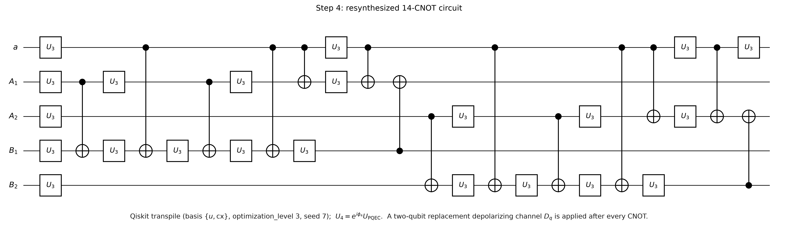
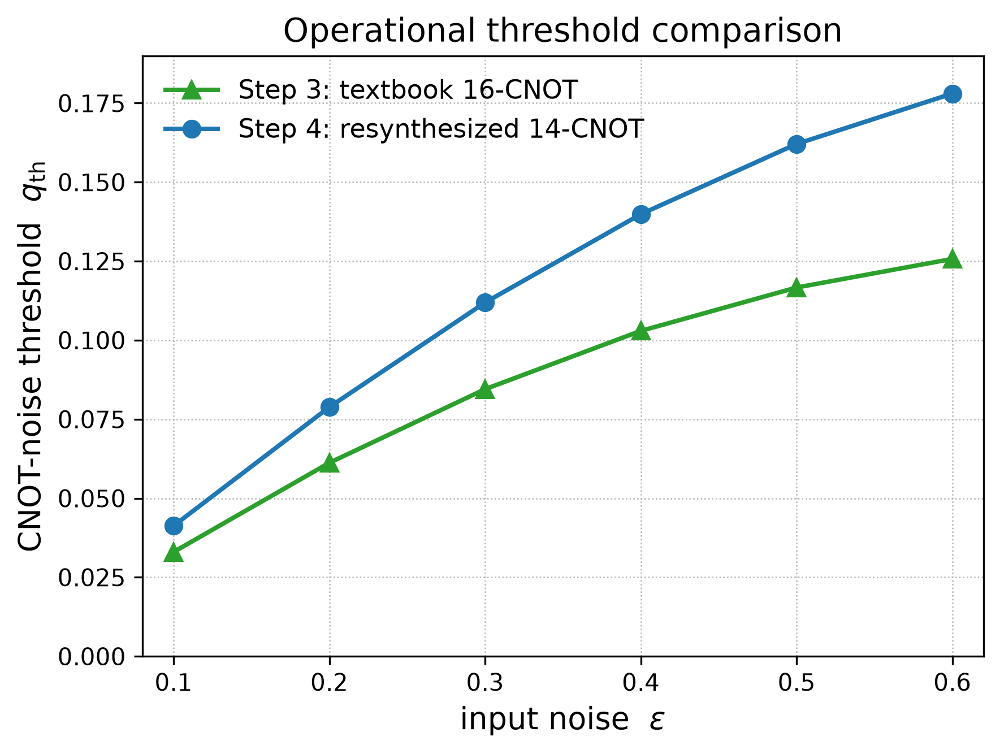

# Step 4 — Resynthesized 14-CNOT implementation with per-CNOT noise

> Branch of **PQEC Operational Threshold**. Same gadget unitary, fewer noisy CNOTs.

## What this branch is about

The gadget `H_a·CSWAP·CSWAP·H_a` is a fixed 5-qubit unitary. Two independent peephole
optimizers reduce it **16 → 14 CNOTs**, each verified to implement the *identical* unitary:

- **Qiskit** `transpile`, basis `{u, cx}`, `optimization_level 3`, `seed_transpiler 7`
- **pytket** `FullPeepholeOptimise`

`14 = 2×7` is the per-Fredkin optimum. (This is the count the tools produced, **not** a proof
of minimality.) The equality is a full-unitary equality up to global phase,
`U₄ = e^{iφ₄} U_PQEC`, so it holds for all five-qubit inputs.



Noise model is **identical to Step 3**: `D_q` after every CNOT, single-qubit gates ideal.

## Numerical results

Replay verification (`pqec_resynth_noise.py`, pure PennyLane):

| check | result |
|--|--|
| Hilbert–Schmidt overlap with `U_PQEC` | **1.000000000000** |
| `q = 0` read-out vs `Tr(Oρ²)/Tr(ρ²)` | 1.1e-16 (`Φ⁺`), 4.4e-16 (`ZZ`) |
| `F(q)` monotone decreasing | max upward step −0.005 |

Exact parity-weighted operator (`s = 1−q`):

```
τ_A⁽⁴⁾ = s¹⁰/16 [ (1+3s²t²)II + 2s⁴t(1+t)(XX−YY) + s³(1+s)t(1+t)ZZ ]
Q₄ = s¹⁰/4 (1+3s²t²),   N_Φ,₄ = s¹⁰/16 [1+3s²t² + s³(1+5s)t(1+t)]
F₄ = ¼[1 + s³(1+5s)t(1+t)/(1+3s²t²)],   K₄(1) = 7/4
```

**Threshold** `q_th`, and the gain over the 16-CNOT textbook:

| input ε | 0.10 | 0.20 | 0.30 | 0.40 | 0.50 | 0.60 |
|--|--|--|--|--|--|--|
| Step 3 (16) | 0.0330 | 0.0612 | 0.0845 | 0.1029 | 0.1167 | 0.1257 |
| **Step 4 (14)** | **0.0413** | **0.0788** | **0.1119** | **0.1399** | **0.1621** | **0.1780** |
| ratio | 1.25 | 1.29 | 1.32 | 1.36 | 1.39 | **1.42** |



The gain is **1.25–1.42×**, *more* than the naive `16/14 = 1.14` count ratio — so the
machine-found layout also propagates noise a little more favourably. `F₄ > F₃` provably holds
for `0 < s < 1`, `t > 0`.

## Core files

| file | role |
|--|--|
| `resynthesize_gadget.py` | 16→14 reduction (needs `qiskit` / `pytket`), unitary equivalence check |
| `pqec_resynth_noise.py` | hard-coded 14-CNOT `GATES` list, PennyLane replay + threshold |
| `draw_resynth_pl.py` | PennyLane circuit diagram |
| `SWAP_GADGET_OPTIMIZATION.md` | write-up of the CNOT-reduction routes |

## Reproduce

```bash
git switch step-4-resynthesized-14cnot
python pqec_resynth_noise.py    # unitary check + threshold table + figure
python draw_resynth_pl.py       # circuit diagram
python resynthesize_gadget.py   # (optional) re-derive 16→14, needs qiskit/pytket
```

## Relation to the other steps

Same unitary as Steps 1–3 with 14 instead of 16 noisy CNOTs. Step 5 reaches the *same* count
by training instead of peephole optimisation — and shows that the **arrangement**, not the
count, sets the threshold.

## Branch map

| branch | contents |
|--|--|
| [`main`](../../tree/main) | integrated project: all steps, comparison code, full write-ups, paper figures |
| [`setup-bell-input`](../../tree/setup-bell-input) | Setup — Bell-isotropic input `ρ_t` preparation + verification |
| [`step-1-ideal-pqec`](../../tree/step-1-ideal-pqec) | Step 1 — ideal one-round PQEC baseline |
| [`step-2-fredkin-noise`](../../tree/step-2-fredkin-noise) | Step 2 — CSWAP-level global replacement depolarizing noise |
| [`step-3-textbook-16cnot`](../../tree/step-3-textbook-16cnot) | Step 3 — textbook 16-CNOT implementation, per-CNOT noise |
| [`step-4-resynthesized-14cnot`](../../tree/step-4-resynthesized-14cnot) | Step 4 — resynthesized 14-CNOT implementation, per-CNOT noise |
| [`step-5-learned-14cnot`](../../tree/step-5-learned-14cnot) | Step 5 — learned & pruned 14-CNOT implementation, per-CNOT noise |
| [`iterated-noisy-pqec`](../../tree/iterated-noisy-pqec) | repeated-round study: fixed points of the effective nonlinear map |
| [`archive-branched-substeps`](../../tree/archive-branched-substeps) | snapshot before the Step renumbering (old 3a/3b/4a/4b/5a/5b/5c labels) |

Every step branch is a **full copy** of the project (so it is independently checkout-able and
runnable); this README describes what *this* branch is for, and `STEP_GUIDE.md` lists its
inputs, noise model, scripts and outputs.

## Conventions used throughout

- input `ρ_t = ¼[II + t(XX − YY + ZZ)]`, `t = 1 − ε`; target `Φ = |Φ⁺⟩⟨Φ⁺|`; `F_bare = (1+3t)/4`
- wire ordering `(a, A₁, A₂, B₁, B₂) = (0,1,2,3,4)`: ancilla, retained register `A`, discarded `B`
- read-out `F = ⟨Z_a ⊗ O⟩ / ⟨Z_a⟩ = Tr(Oρ²)/Tr(ρ²)` (ancilla-parity correlator)
- **all single-qubit gates are ideal**; noise is applied only where the step's model says

## Setup

```bash
python -m venv .venv && source .venv/bin/activate
pip install -r requirements.txt
```

