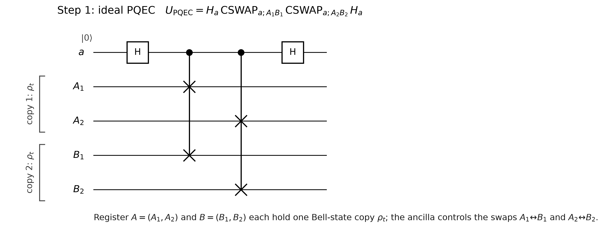

# Step 1 — Ideal one-round PQEC baseline

> Branch of **PQEC Operational Threshold**. The noiseless reference every noisy step is
> measured against.

## What this branch is about

The PQEC primitive is the **SWAP-test gadget**: two identical noisy copies `ρ ⊗ ρ` enter, an
ancilla-controlled SWAP is applied to the 2-qubit register, and reading the ancilla extracts

```
U_PQEC = H_a · CSWAP(a;A₁,B₁) · CSWAP(a;A₂,B₂) · H_a
P(ρ)   = ρ² / Tr[ρ²]        (concentrates weight on the dominant eigenvector)
```



Two equivalent read-outs (both reused when the gadget is made noisy in Steps 2–4):

- **state extraction**: `ρ² = (ancilla |0⟩ block) − (|1⟩ block)` → `purify_once(ρ) = ρ²/Tr[ρ²]`
- **observable / parity correlator**: `⟨O⟩ = ⟨Z⊗O⟩/⟨Z⊗I⟩ = Tr(Oρ²)/Tr(ρ²)`

## Numerical results

| check | result |
|--|--|
| `purify_once(ρ) == ρ²/Tr[ρ²]` (500 random states) | max err **2.36e-16** |
| `⟨Z⊗O⟩/⟨Z⊗I⟩ == Tr(Oρ²)/Tr(ρ²)` (200 random states) | max err **3.33e-16** |
| `purify_once(ρ_t) == ρ_t²/Tr` (40 values of ε) | max err **2.22e-16** |

Closed forms on the isotropic input:

```
Q₁(t) = Tr(ρ_t²)   = (1 + 3t²)/4
N_Φ,₁(t) = Tr(Φρ_t²) = (1 + 3t)²/16
F₁(t) = (1 + 3t)² / (4(1 + 3t²))
F₁(t) − F_bare(t) = 3t(1−t)(1+3t) / (4(1+3t²)) > 0   for 0 < t < 1
```

On `ρ_t`, `|Φ⁺⟩` is the strictly dominant eigenvector for **every ε < 1** (`1−3ε/4 > ε/4`), so
the ideal gadget drives `F, C → 1` for all `ε < 1` — it even **re-entangles a separable input**
(`2/3 ≤ ε < 1`). Only `ρ = I/4` at `ε = 1` is a fixed point. Concurrence after ℓ=3 rounds:

| ε | 0.30 | 0.50 | 2/3 | 0.80 |
|--|--|--|--|--|
| `C` in → out | 0.55 → 1.00 | 0.25 → 1.00 | 0.00 → 1.00 | 0.00 → 0.98 |

## Core files

| file | role |
|--|--|
| `pqec_gadget.py` | ideal gadget: `purify_once` / `purify_rounds` / `obs_purified`, verification, recovery demo |
| `draw_pqec_gadget.py` | gadget circuit → `circuit_pqec_gadget.png` |
| `figures/step1_ideal_pqec_circuit.png`, `pqec_gadget_recovery.png` | paper figure, recovery curves |

## Reproduce

```bash
git switch step-1-ideal-pqec
python pqec_gadget.py          # verification + ρ_t recovery demo
python draw_pqec_gadget.py     # circuit diagram
```

## Relation to the other steps

This is the `q → 0` limit of Steps 2–5: every noisy threshold is defined by where the noisy
`F` falls back to `F_bare`, with `F₁` above as the unreachable ideal ceiling.

## Branch map

| branch | contents |
|--|--|
| [`main`](../../tree/main) | integrated project: all steps, comparison code, full write-ups, paper figures |
| [`setup-bell-input`](../../tree/setup-bell-input) | Setup — Bell-isotropic input `ρ_t` preparation + verification |
| [`step-1-ideal-pqec`](../../tree/step-1-ideal-pqec) | Step 1 — ideal one-round PQEC baseline |
| [`step-2-fredkin-noise`](../../tree/step-2-fredkin-noise) | Step 2 — CSWAP-level global replacement depolarizing noise |
| [`step-3-textbook-16cnot`](../../tree/step-3-textbook-16cnot) | Step 3 — textbook 16-CNOT implementation, per-CNOT noise |
| [`step-4-resynthesized-14cnot`](../../tree/step-4-resynthesized-14cnot) | Step 4 — resynthesized 14-CNOT implementation, per-CNOT noise |
| [`step-5-learned-14cnot`](../../tree/step-5-learned-14cnot) | Step 5 — learned & pruned 14-CNOT implementation, per-CNOT noise |
| [`iterated-noisy-pqec`](../../tree/iterated-noisy-pqec) | repeated-round study: fixed points of the effective nonlinear map |
| [`archive-branched-substeps`](../../tree/archive-branched-substeps) | snapshot before the Step renumbering (old 3a/3b/4a/4b/5a/5b/5c labels) |

Every step branch is a **full copy** of the project (so it is independently checkout-able and
runnable); this README describes what *this* branch is for, and `STEP_GUIDE.md` lists its
inputs, noise model, scripts and outputs.

## Conventions used throughout

- input `ρ_t = ¼[II + t(XX − YY + ZZ)]`, `t = 1 − ε`; target `Φ = |Φ⁺⟩⟨Φ⁺|`; `F_bare = (1+3t)/4`
- wire ordering `(a, A₁, A₂, B₁, B₂) = (0,1,2,3,4)`: ancilla, retained register `A`, discarded `B`
- read-out `F = ⟨Z_a ⊗ O⟩ / ⟨Z_a⟩ = Tr(Oρ²)/Tr(ρ²)` (ancilla-parity correlator)
- **all single-qubit gates are ideal**; noise is applied only where the step's model says

## Setup

```bash
python -m venv .venv && source .venv/bin/activate
pip install -r requirements.txt
```

